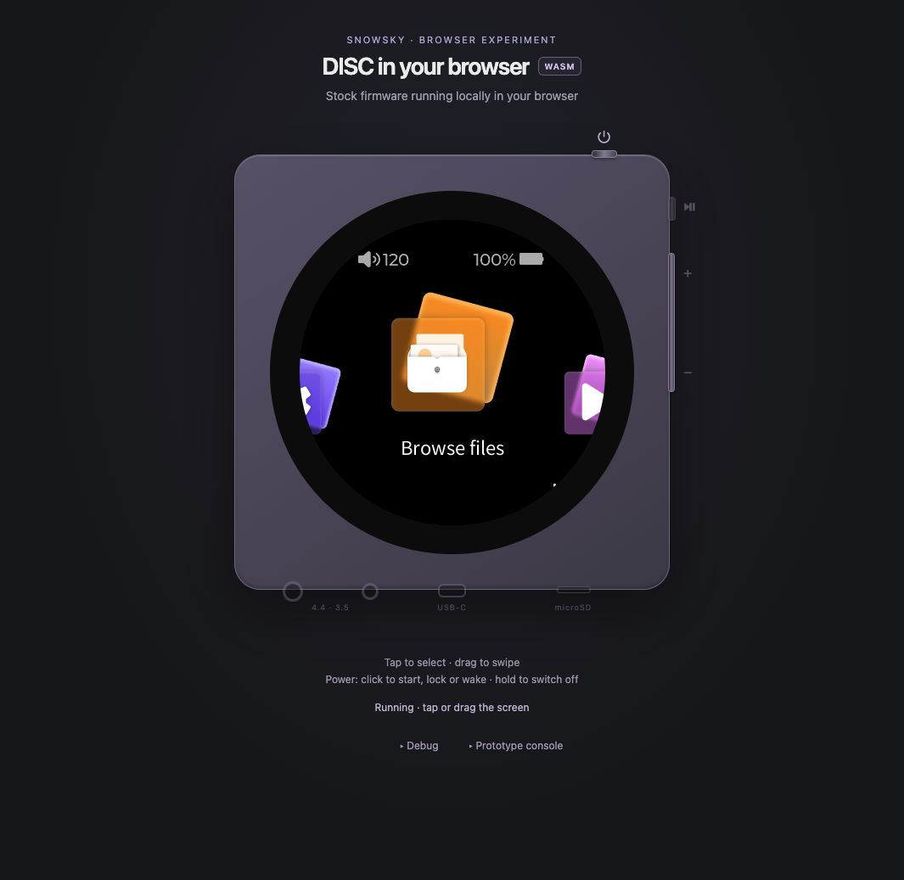

# snowsky-disc-qemu

**Run the FiiO SNOWSKY DISC firmware on your computer — and use it from your browser.**

The real stock interface, media library and audio decoder run under `qemu-user`.
Browse an SD card, play a track, navigate by touch and operate the player's buttons
without a physical device.

[Quick start](#run-the-emulator) · [Viewer](#viewer) · [Controller](#controller) · [FiiO Control compatibility](#fiio-control-compatibility) · [Source releases](https://github.com/eudj1n/snowsky-disc-qemu/releases) · [Validation & screenshots](docs/STATUS.md)

<table>
  <tr>
    <td align="center"></td>
    <td align="center"></td>
    <td align="center"></td>
  </tr>
  <tr>
    <td align="center"><b>Navigate the stock UI</b></td>
    <td align="center"><b>Play local audio</b></td>
    <td align="center"><b>Explore device screens</b></td>
  </tr>
</table>

*Actual V2.57 emulator captures ([capture details](docs/images/README.md)). The browser viewer adds the CSS device and interactive controls shown below.*

Three components share one repository:

- **Emulator** — runs the original MIPS firmware in Docker, provides the device interfaces
  it needs, and makes its UI, storage, audio and local protocol available for testing.
- **Viewer** — a browser interface to the running emulator, with a live screen,
  touch gestures, physical controls, sound and peripheral simulation.
- **Controller** — Python clients for playback, library and settings over the
  player's network APIs. Works with a physical DISC or the emulator; direct
  device control needs no Docker or firmware files.

## Emulator

The stock `mq_ui` and `mq_player` applications for **Ingenic X2000 / MIPS32**
run under `qemu-user`. The project supplies framebuffer, input, storage and hardware stubs so the
original applications can operate together.

### What you can do

| Capability | Verified behavior |
| --- | --- |
| **Boot and navigate** | Boot to the English main menu; open applications and settings with taps, holds and swipes. |
| **Browse and scan media** | Browse a FAT SD card, build the stock media-library index, and exercise V2.57 insertion-triggered scans, including Cyrillic filenames. |
| **Decode local audio** | Capture the stock decoder's PCM output, listen through the viewer, or export WAV. Captured samples have been checked against source audio. |
| **Exercise device controls** | Play/pause, assigned volume gestures, screen sleep/wake, and guest-only power lifecycle. |
| **Connect a client** | Query settings, library and playback over local FiiO Link TCP; control volume and playback from the host. |
| **Reproduce a firmware build** | Validate version and binary fingerprints before boot; run integration checks in a fresh disposable environment. |

### Run the emulator

Requires **Docker Engine 28.1+** and **Docker Compose 2.36+** on macOS or Linux.
Download and unpack the official firmware first:
**[firmware preparation](firmware/README.md)**. Firmware is not included in this repository.

```sh
git clone https://github.com/eudj1n/snowsky-disc-qemu.git
cd snowsky-disc-qemu

# Put your music in ./emulator/sdcard before setup.
# Point to the unpacked main-OS chunk directory, not the ZIP or its parent.
./run.sh up /path/to/SNOWSKY_DISC_update_.../main_os/ota_v257
./run.sh boot

# Open the interactive viewer at http://localhost:8080.
./run.sh view
```

The reviewed default is selected by `firmware/active-version` (currently V2.57);
`FW_VERSION` in `.env` can pin an installation to a reviewed version. See
[firmware profiles](docs/FIRMWARE_PROFILES.md). Setup verifies and extracts the firmware, builds the shims,
prepares the emulated SD card, and saves the OTA path in `.env`. Boot starts the
firmware processes and writes screen captures to `shots/`.

Inside the stock UI, open **Browse files** to select your music. Use
**Settings → Update media lib → Update now** to populate the indexed library.
Normal boot remounts the card; it does not generate an SD-insertion auto-scan event.
After changing files in `./emulator/sdcard`, run `./run.sh boot` again to rebuild the emulated
card from that folder. Guest-only card changes are replaced during this setup.

<details>
<summary><b>Command-line controls and container lifecycle</b></summary>

```sh
./run.sh capture          # Save framebuffer captures in ./shots/.
./run.sh tap 180 180      # Tap using visible screen coordinates.
./run.sh audio            # Export the current recording to ./shots/audio.wav.
./run.sh shell            # Open a shell inside the emulator container.
./run.sh stop             # Stop guest processes and the viewer.
./run.sh down             # Remove containers; keep the extracted-rootfs volume.
```

The pipeline lives in `emulator/scripts/`; `run.sh` is its host entry point.
`compose.yaml` defines the container and localhost port mappings.
For direct Compose setup, copy `.env.example` to `.env`, set `OTA_DIR`, then run
`./run.sh up` and `./run.sh boot`.

</details>

**Scope:** this is userspace emulation, with host-managed guest shutdown and
simulated hardware interfaces. USB storage/DAC, Bluetooth audio, native DSD/DoP and
hardware-accurate timing remain unvalidated. Docker runs the emulator container
privileged for its mounts, message queues and MIPS binfmt setup; services bind to
localhost. See [emulation internals](docs/EMULATION.md) and [validation limits](docs/STATUS.md).

## Viewer

**A live, interactive player in the browser.** The viewer streams the emulator's
actual framebuffer inside a responsive CSS device. Its controls send input
back to the stock applications. The **QEMU** badge identifies this host-backed mode.

<p align="center">
  
</p>

Start it with `./run.sh view` after boot, then open **http://localhost:8080**.

| Control | Interaction |
| --- | --- |
| **Screen** | Click to tap, drag to swipe, hold to long-press. |
| **Volume buttons** | Single, double and hold gestures follow the assignments in the stock settings. |
| **Play / pause** | Use the physical button or the stock player screen. |
| **Power / lock** | Click to sleep/wake; hold to stop the guest; click while off to boot again. |
| **Headphone jack** | Click the lower-left jack to enable browser sound. Stock volume controls also adjust browser output gain. |
| **USB connector** | Toggle simulated USB power (V2.57 idle-power inhibition). |
| **SD slot** | Remove and reinsert the emulated card; insertion follows the stock auto-scan rules. |
| **Debug** | Expand for gesture shortcuts and replaying the current audio capture. |

Screen brightness follows the stock shade slider. The stream sends lossless PNGs
when pixels change, with occasional idle refreshes. The device scales to narrow
screens without a photo asset or manual alignment.

The headphone control enables browser audio; USB simulates power detection on
V2.57, preventing idle power-off while connected (no USB data/DAC). See
[power behavior](docs/IDLE_POWER.md). SD
removal performs an actual guest unmount and refuses a busy card. These behaviors
and setup options are covered in the **[viewer guide](docs/VIEWER.md)**.

## Experimental: firmware running entirely in the browser

The [browser experiment](docs/BROWSER.md) runs V2.57 locally through
TinyEMU/WebAssembly → RISC-V Linux → qemu-mipsel. A static server supplies the
files; the browser executes the firmware. Docker is needed to build the bundle.

<p align="center">
  
</p>

The **WASM** page shares the Viewer’s layout and device proportions. Power starts
or wakes it; hold to stop the VM. Status is below the player; Debug holds Back,
Start/Stop and Save screen, alongside the optional Prototype console.

The prototype supports the stock menu, taps, swipes, Back and screen sleep/wake.
Audio, SD/media import and saved state are not connected; lockscreen stability
remains an open research item. It has a separate build/run command under
`research/browser/`. See the [reproduction guide and limitations](docs/BROWSER.md).

## Historical experiment: diskOS UI preview

The [unsupported diskOS preview](docs/DISKOS_PREVIEW.md) preserves a source-built
UI running over the stock V2.40 backend. The 2026-09-13 experiment verified touch
navigation, library scanning and WAV playback with PCM comparison. Its build
helpers and isolated launcher live in `research/diskos/`; known playback/font
limitations and the original source revision are recorded in the report.

This is historical evidence, with no ongoing support or current-firmware claim.
It can return to active experimental status after upstream fixes and support for
the project's current firmware are reviewed and validated locally.

## Controller

**Control a physical SNOWSKY DISC or the emulator through the same network APIs.**
The `controller/` Python package provides FiiO Link TCP and HTTP clients, an
optional WebSocket client, discovery tools and bridges. Direct TCP/HTTP control
uses Python's standard library and runs independently of the emulator and viewer.
The WebSocket client and WebSocket bridge additionally require `aiohttp`.

| Area | Available helpers |
| --- | --- |
| **Playback** | Track selection, play/pause, seeking, modes, favorites and guarded queue selection. |
| **Library** | Track, artist, album and genre catalogs; folder browsing, file transfer and custom playlists. |
| **Settings** | Volume, gain, filters, channel balance, basic PEQ, work modes and codec preferences. |
| **Lock screen** | Custom image uploads and supported system/custom theme metadata. |

See the **[controller capability summary](docs/DISC_CAPABILITIES.md)** for verified
operations, firmware limits and remaining research.

From the repository root, query settings, tracks and current playback without
changing them:

```sh
# Running emulator (localhost TCP 12100).
python3 -m controller.fiio_link

# Physical DISC: replace the example address with your player's LAN address.
python3 -m controller.fiio_link --host 192.168.1.50
```

The stock TCP service accepts one client at a time; disconnect FiiO Control or
another controller before querying it. Physical-device HTTP uses port 12103;
the emulator's direct stock HTTP endpoint is localhost port 12113.

<details>
<summary><b>FiiO Link and the optional WebSocket bridge</b></summary>

An optional WebSocket-to-TCP adapter provides **localhost:12103** and a read-only
protocol inspector for the emulator:

```sh
docker compose --profile wsbridge up -d wsbridge
./run.sh wscheck --control  # Verify TCP/WS control; leaves playback paused.
# Inspector: http://localhost:12103/bridge/
docker compose --profile wsbridge stop wsbridge
```

The bridge is an explicit adapter to the stock service. It runs as a separate,
optional container. Disconnect the inspector before using another control client:
the stock TCP service accepts one client at a time.
See [network setup](docs/NETWORK.md), [WebSocket bridge](docs/WEBSOCKET.md),
and [protocol reference](docs/PROTOCOL.md).

</details>

## FiiO Control compatibility

**FiiO Control on iPhone can discover and connect to the emulator through the
optional host LAN bridge.** In the manual test on 2026-09-16, the app discovered
the host, connected, opened the emulator's media library and found it again after
a confirmed disconnect. The owner reports FiiO Control **4.6.0** for these tests;
the emulator runs DISC **V2.57**.

The [LAN bridge setup](docs/DISCOVERY.md) forwards the stock TCP/HTTP services and
announces the emulator on a trusted LAN. It requires an explicit phone IP allowlist
and a time limit because the stock APIs have no authentication. Normal startup
remains localhost-only. The tested phone connection uses TCP/HTTP directly.

This verifies discovery, connection and library access. Full app coverage,
background reconnect and Android interoperability remain unvalidated. Captures
from FiiO Control connected to a **physical DISC** additionally document playback,
library, settings and theme workflows; their evidence and implementation status
are recorded separately in the [FiiO Control research](docs/FIIO_CONTROL_APP.md).

## Firmware support & development

**Active development: V2.57 on `2.x`.** We support one firmware at a time: the
latest version validated in the emulator. Older versions remain available as
historical releases, without promised backports or continuing integration coverage.
An OTA announcement alone does not replace the working version.

V2.40's runtime profile is still selectable during the transition; its removal
from current code is a separate task. The historical `v2.40` release is retained.
The existing `v2.57` is a **pre-release snapshot**; the eventual stable V2.57 release
will use a new name such as `v2.57-r1`. Hosted firmware CI runs only active V2.57.

A daily [OTA monitor](docs/OTA.md) creates one tracking Issue for each newly detected
main-OS/recovery pair. Firmware analysis, support PRs, release preparation and Issue
closure remain manual. See the [porting process](docs/PORTING.md).

<details>
<summary><b>Existing installations and switching firmware</b></summary>

Keep `FW_VERSION=2.40` in `.env` for an existing V2.40 rootfs. Switching the version
setting does not migrate an extracted rootfs; mismatches are rejected.

To use V2.57 separately, set `FW_VERSION=2.57` and a distinct `WORK_VOLUME`, such as
`snowsky-disc-work-v257`, in `.env`. Run `./run.sh up` with the V2.57 OTA directory, then
`./run.sh boot`. This preserves the previous work volume.

</details>

Development happens on **`2.x`**. Before switching to the next validated firmware,
preserve the previous version's final validated snapshot in a source release.
Releases may also ship improvements before the next vendor update; emulator
revisions against the same firmware use tags such as `v2.40-r1`.
Firmware-free CI and clean-volume integration for the active firmware provide release
evidence. See [CI & release gates](docs/CI.md), [release notes](https://github.com/eudj1n/snowsky-disc-qemu/releases)
and [CHANGELOG.md](CHANGELOG.md).

## Documentation & source map

See [repository components and Python entry points](docs/REPOSITORY.md) for the
source layout, dependency boundaries and test locations.

| Area | Start here | Source |
| --- | --- | --- |
| **Emulator** | [How it works](docs/EMULATION.md) · [Current results](docs/STATUS.md) | `run.sh`, `emulator/scripts/`, `emulator/shims/`, `docker/` |
| **Viewer** | [Viewer guide](docs/VIEWER.md) · [Touch](docs/TOUCH.md) · [Buttons](docs/KEYS.md) | `viewer/server.py`, `viewer/static/` |
| **Media** | [Audio](docs/AUDIO.md) · [Library](docs/MEDIA_LIBRARY.md) · [Settings](docs/SETTINGS.md) | `emulator/sdcard/`, `emulator/runtime/audio.py` |
| **Controller** | [Capabilities](docs/DISC_CAPABILITIES.md) · [Network](docs/NETWORK.md) · [Protocol](docs/PROTOCOL.md) · [WebSocket](docs/WEBSOCKET.md) · [Opt-in phone LAN bridge](docs/DISCOVERY.md) | `controller/fiio_link.py`, `controller/bridge/ws_bridge.py`, `controller/bridge/lan_bridge.py` |
| **Firmware research** | [Acquisition](firmware/README.md) · [Porting](docs/PORTING.md) · [Reverse engineering](docs/RE.md) | `firmware/`, `research/ghidra/` |
| **Browser experiment** | [Build, results and next milestone](docs/BROWSER.md) | `research/browser/`, `research/tests/test_browser_*.js` |
| **Historical diskOS experiment** | [Preview results, limitations and status](docs/DISKOS_PREVIEW.md) | `research/diskos/` |
| **Contributing** | [CI](docs/CI.md) · [Agent instructions](AGENTS.md) | `ci/`, `.github/workflows/` |

## License & scope

Independent project, not affiliated with or endorsed by FiiO/SNOWSKY.
Project code and the owner's device photo are [MIT licensed](LICENSE). Vendor
firmware, branding and firmware UI shown in screenshots are not relicensed here.

Firmware is obtained separately from FiiO and is not distributed in this repository
or its releases. This project runs unpacked applications for research and testing;
its releases are emulator source code, not firmware to flash onto a device.
