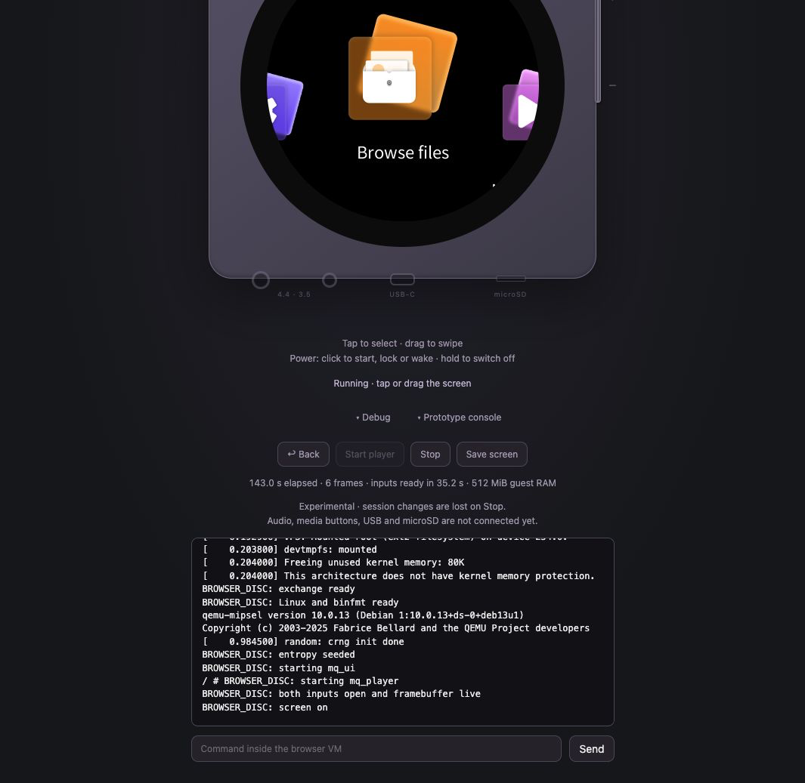

# DISC running inside a browser — experimental prototype

This is separate from the [normal browser viewer](VIEWER.md). Here the browser
executes Linux, QEMU and the stock DISC programs. The host serves static files;
there is no server-side firmware process or framebuffer API.

```
Browser Web Worker
  TinyEMU / WebAssembly → RISC-V Linux → qemu-mipsel → mq_ui + mq_player
       ↕ virtual 9P filesystem (in browser memory)
  Canvas framebuffer ← frame.bgrx     gesture-N → MIPS input events
```

The prototype runs the V2.57 main menu with taps and swipe navigation. This is a research
prototype, not a replacement for the validated Docker emulator. It does not
enable another firmware profile or change the normal startup scripts.


*Actual WASM browser capture, 2026-09-17. The page shares the Viewer’s device
geometry and styling; the WASM badge identifies execution inside the browser.
Dimmed controls are not connected in this experiment. [Capture details](images/README.md).*

## Project status

This experiment is maintained under `experiments/browser/` on the development
branch `2.x`. It has an independent build/run workflow and experimental status;
the normal viewer and emulator keep their own acceptance criteria.

| Area | Browser result |
| --- | --- |
| Startup and display | Real V2.57 menu and framebuffer; observed startup roughly 100–160 seconds on the development machine, with 512 MiB guest RAM. |
| Navigation | Taps, swipe transport, Browse files entry and return by swipe/Back verified. |
| Screen button | Manual sleep → Wakeup → clock → upward-swipe unlock verified without restarting the VM. |
| Lockscreen stability | One SIGBUS after a horizontal swipe remains unisolated; no complete idle/power lifecycle claim. |
| Media and sound | SD/media import and browser audio delivery are not implemented. |
| State | VM changes are discarded on Stop/restart; persistence is not implemented. |

Only source, instructions and firmware-free tests belong in Git. The locally
built bundle contains firmware and is not a distributable project artifact.

## Build and run locally

From the repository root, with Docker available and the stock OTA unpacked:

```sh
bash experiments/browser/run.sh build /absolute/path/to/main_os/ota_v257
bash experiments/browser/run.sh serve
```

Open [the local prototype](http://127.0.0.1:8091/) and click the **Power** button
on the top edge. The server binds to localhost only. The page uses the same
513 px square body and native 360×360 display as the [QEMU Viewer](VIEWER.md),
scaling proportionally on narrow screens. The body has a flat black bezel and
no logo or lettering. The shared stylesheet is `viewer/static/device.css`;
the build copies it into the standalone bundle without a Viewer runtime dependency.

| Control | Action |
| --- | --- |
| **Power, short press while off** | Start a fresh browser VM. |
| **Power, short press while running** | Lock or wake the firmware screen. |
| **Power, hold 1.8 seconds** | Stop the worker and clear the screen; session changes are discarded. Works during boot or a pending input too. |
| **Power after a reported VM/firmware failure** | Explicitly restart with a fresh VM. No automatic input retry. |
| **Screen** | Tap or swipe; left → right goes back, bottom → top dismisses the clock after waking. |
| **Debug** | Back shortcut, explicit Start/Stop, Save screen, boot/frame metrics and limitations. |
| **Prototype console** | Linux output and commands inside the browser VM, not the host. |

Status appears below the player. **Debug** and **Prototype console** are collapsed
by default; their headers sit next to each other and their contents expand below.
Space/Enter also operates focused Power. A cancelled pointer/keyboard hold does
not send a short press. Save screen exports actual Canvas pixels.



The side media/volume buttons and bottom audio/USB/microSD sockets show the physical
layout but remain disabled: those features are not implemented by the prototype.
A gesture is sent on pointer release and played inside the VM; wait for it to
finish before the next action. Touch and Back are disabled while asleep or while
an earlier gesture awaits acknowledgement. Injection acknowledgement alone is not
proof that the screen has woken. Waking can show the stock clock lockscreen.

For page-only changes, stop the VM, update the static assets, reload and start:

```sh
bash experiments/browser/run.sh refresh-ui
```

This copies UI files and the shared stylesheet with a content-based resource
revision, without rebuilding or modifying the kernel, disk or firmware bundle.

Docker is required to build the bundle, not to run it. Once built, serving
`work/browser-disc/www` is sufficient. Do not rebuild that directory while a
VM is running: its disk blocks are fetched on demand. Stop the VM, rebuild,
reload the page, then start it again.

The build:

1. Downloads public dependencies pinned by SHA-256 in
   [sources.json](../experiments/browser/sources.json). No firmware is downloaded.
2. Runs the existing exact-build validation, shim compilation, device setup and
   configuration priming in a **fresh disposable Compose stack**, with no host
   ports or user media. Exports the stopped rootfs, then removes that stack and
   its volume. The interactive stack and work volume are not used.
3. Builds a RISC-V Linux kernel and a small native RISC-V framebuffer/input
   adapter. The adapter and QEMU live outside the MIPS chroot.
4. Makes a 256 MiB ext2 disk image and splits it into 256 KiB HTTP blocks.
   Copies the WASM engine and page into `work/browser-disc/www`.

All downloaded sources, firmware, intermediate rootfs trees, disk images and
captures stay under ignored `work/browser-disc/`. `www/manifest.json` records
the firmware version and kernel, QEMU and disk hashes. Do not publish the
generated directory: it contains proprietary firmware. The source implementation
and these notes can be committed independently.

## Implementation and boundaries

- TinyEMU RISC-V source/demo: 2019-12-21, MIT. Its license is copied into the
  bundle. The precompiled WASM is reused; its JS file-download callback is
  adapted to deliver virtual 9P exports to the page's worker messages.
- Linux: the exact `a3b1e7acc6a181e04e9a943942084395df4498dd` revision from
  Bellard's recipe. `BINFMT_MISC`, `POSIX_MQUEUE`, `SYSVIPC` and kernel-config
  inspection are enabled. Modern compiler compatibility changes are confined
  to RISC-V ISA flag spelling and VDSO linking. This is an old research kernel,
  not a maintained general-purpose browser OS.
- QEMU: Debian RISC-V static `qemu-mipsel` 10.0.13, outside the DISC rootfs.
  `binfmt_misc` registers only MIPS32 little-endian executables **inside the
  virtual kernel**. No RISC-V handler is registered in Docker's kernel.
- The browser provides 64 fresh bytes from Web Crypto to initialize the virtual
  kernel's entropy pool. No reusable random seed is baked into the disk.
- The standard MIPS `fbshim`, `asndshim` and `tinyshim` are retained. The normal
  guarded key patch comes from the existing preparation pipeline; the browser
  adapter adds no stock-binary patches.
- The adapter reads `emu/fb-live`, samples that sub-buffer, then checks the
  marker again. The page reverses pixel order and converts BGRX to RGBA. As in
  the existing viewer, this is not an atomic framebuffer fence.
- Touch uses explicit **16-byte MIPS input_event** records; the RISC-V host's
  native timeval layout must not be used. The adapter flips both coordinates
  and separates tap press/release by 300 ms of guest time. Swipes use 12
  interpolated moves, spaced 28 ms apart, matching the normal viewer. Only one
  gesture may be pending. Missing acknowledgement never causes an automatic retry.
- The screen button sends only the reviewed `0x103` key with a 120 ms
  press/release on `event0`, using the same MIPS event layout as touch. It has
  no arbitrary key-code interface, long-press shutdown or automatic retry.
  Screen state is read from the standard backlight brightness stub; injection
  acknowledgement alone does not establish a successful wake.
- TinyEMU's old path walker does not resolve `/` as an import directory; the
  guest sets the 9P import directory to `.`. Using `/` silently drops imported
  commands even though framebuffer exports continue working.
- All firmware, filesystem changes, console commands and input processing run
  inside WASM. The VM has no configured external network interface or relay.
  Disk and 9P backing files are fetched from the local static server.

## Current scope and evidence

The initial local browser run on 2026-09-17 reached both open input devices and
a fresh framebuffer in about 35.5 seconds, then the English main menu at about
99.7 seconds. The input/frame readiness signal is **not** proof that the menu
has finished loading; the stock splash appears first. Timings are observations
from this development machine, not performance guarantees.

After fixing the import-directory path, a fresh browser boot reached the menu
again. A real click on its central **Browse files** icon produced `tap 1 injected`
and a new frame showing the stock **Browse files /tmp/sdcard** screen. The card
is intentionally absent/empty in this prototype; this verifies UI navigation,
not SD mounting or media playback. The worker's Stop control was also exercised.
Fresh browser entropy initialized the virtual kernel's CRNG at about 0.9 seconds
of guest time; this does not establish a startup-speed improvement.

At the 2026-09-17 checkpoint, firmware-free checks passed: **312 Python tests and 33 JavaScript
tests**, shell syntax and all four standard MIPS shim builds. The RISC-V adapter
also compiled with `-Wall -Wextra -Werror`. The generated bundle's dependency
hashes and local documentation links were checked. No shared emulator runtime
code was changed. Browser-specific acceptance is separate from the normal
Docker lifecycle checks. Both required disposable V2.57 scenarios passed:
`idle` (full TCP/WS lifecycle) and `idle-usb` (including the real 310-second
USB observation). These guard the standard runtime and do not establish the
same long-duration lifecycle coverage inside TinyEMU.

A subsequent browser run with gesture support reached the menu at about 137
seconds. A click opened Browse files; a real left-to-right pointer drag returned
to the main menu, with a fresh frame confirming the transition. Re-entering
Browse files and pressing **Back** also returned to the menu. Both paths were
verified in the browser, beyond input-injection acknowledgements.

Screen-control testing observed the real backlight transition on → off → on,
with the button changing Lock screen → Wakeup → Lock screen and the clock
appearing after wake. A bottom-to-top swipe dismissed the clock both in a diagnostic
run and in the final normal bundle, without restarting the VM. One earlier left-to-right swipe after waking ended `mq_ui` with MIPS
SIGBUS (target signal 10, host wait status 7). Its cause remains unisolated;
do not treat the presence of a Wakeup button as proof of complete lockscreen
stability. No firmware timer or idle policy is overridden by this control.

The same RISC-V kernel/disk also boots with native TinyEMU as a diagnostic
preflight. Native results alone are not browser acceptance. Firmware-free
checks include known-color/opposite-corner framebuffer conversion and rejection
of truncated or concatenated frames. Pointer tests cover scaled coordinates,
small tap jitter, clamped drags, cancellation, second-pointer rejection and
preventing an out-and-back drag from activating an item.

Implemented scope: startup, framebuffer delivery, tap/swipe transport, Back and screen sleep/wake buttons,
worker stop/restart, screen export and a guest console. Sound delivery, SD/media
import, other physical buttons, network control, persistence and mobile-browser
performance remain outside this prototype. Existing firmware sleep/idle settings
are not overridden; complete power/screen lifecycle behavior is not validated.
The page reserves 512 MiB of guest RAM; the browser needs additional memory for
the emulator, disk cache and display. Double CPU emulation makes startup and UI
operations substantially slower than the normal Docker emulator.

## Next milestone: navigation and screen lifecycle stability

Before adding media import or sound:

1. Reproduce and isolate the lockscreen SIGBUS, preserving the exact input
   sequence and crash evidence under ignored `work/browser-disc/`.
2. Verify repeated menu → Browse files → Back and manual sleep → wake → unlock
   cycles in the browser, including cancelled gestures and input while asleep.
3. Observe the actual browser screen timeout and idle shutdown separately.
   Confirm wake after timeout and explicit restart after stopped firmware,
   without fake keepalive input, timer overrides or replaying uncertain commands.

Record browser-visible transitions and guest process/state evidence; input
injection acknowledgements alone do not pass this milestone. Keep browser
acceptance distinct from native TinyEMU diagnostics and the normal Docker
`idle`/`idle-usb` checks. Firmware-free tests remain in the standard test suite;
browser firmware acceptance is a local, opt-in workflow. This milestone and a
documented disposition of the crash are prerequisites for expanding the scope.

References: [TinyEMU](https://bellard.org/tinyemu/),
[JSLinux technical notes](https://bellard.org/jslinux/tech.html),
[TinyEMU kernel/buildroot recipe](https://bellard.org/tinyemu/buildroot.html).
