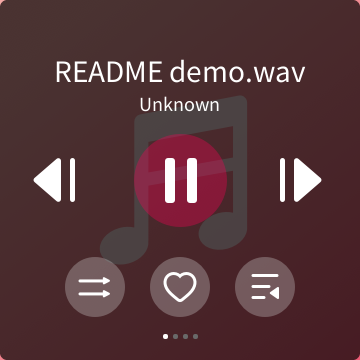
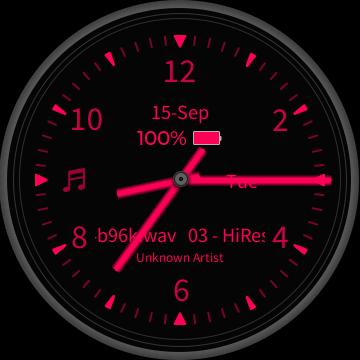

# Status

_Current overview updated 2026-09-16. Dated experiments below retain their original findings._

## Current capabilities

**V2.57 is the active/default firmware; V2.40 is historical.** Its legacy runtime
profile remains selectable pending a separate cleanup, without ongoing support
or backport guarantees. The emulator boots the stock UI,
browses and scans local media, decodes audio, and exposes the FiiO Link service.
The browser viewer adds live navigation, sound, physical-button gestures and
peripheral controls. See the [README](../README.md) for setup and the visual overview.

| Area | Current result | Details |
| --- | --- | --- |
| **Boot / UI** | Fingerprint-validated firmware, English main menu without the first-boot wizard, taps/holds/swipes. Boot waits for network, input and framebuffer readiness. | [Emulation](EMULATION.md), [Touch](TOUCH.md) |
| **Storage** | FAT SD browsing and stock manual indexing. V2.57 insertion-triggered automatic scans handle Cyrillic add/rename/delete cases. Boot remounting alone does not trigger auto-scan. | [Media library](MEDIA_LIBRARY.md) |
| **Audio** | Stock decoder → tinyalsa → PCM capture; source-sample comparisons, WAV export and browser playback with DAC gain. Browser live mode joins the current capture rather than replaying its full history. | [Audio](AUDIO.md) |
| **Viewer** | Current device skin, button hotspots, headphone sound switch, USB charging simulation, real guest SD hotplug, brightness, and collapsed Debug controls. | [Viewer](VIEWER.md) |
| **Controls / power** | Assigned volume gestures, play/pause, sleep/wake and guest-only off/on. Stock libc reboot calls are confined and automatic poweroff requests handled by the viewer. | [Keys](KEYS.md) |
| **Frame transport** | Last-written buffer marker, lossless PNGs on visible changes, periodic idle refresh and device-state SSE. | [Viewer internals](VIEWER.md#how-it-works) |
| **Local protocol** | TCP 12100 settings/catalog and remote playback: list-position selection, next/previous, seek, modes, albums and built-in favorites. Current-queue selection checks fresh bounds and needs no label, verified on V2.40/V2.57. Optional native WS→TCP bridge on host 12103; direct stock HTTP on 12113. Physical DISC V2.57 comparisons are recorded separately. | [Remote control](REMOTE_CONTROL.md), [WebSocket](WEBSOCKET.md) |
| **Stock file/library API** | HTTP folders, streamed uploads/progress and single-path deletion; custom playlist create/rename/add/remove/delete. Network scanning indexes uploaded music. Current-cover JPEG retrieved on physical V2.57. | [HTTP API](HTTP_API.md) |
| **Remote settings** | TCP/WS gain, DRE, filter, SPDIF, channel balance and user PEQ/master gain with readback and SQLite persistence checks. Balance L20..R20 also checks the opposite-channel DAC attenuation writes. Actual USB/AirPlay/BT and DSP response remain unvalidated. | [Settings protocol](REMOTE_SETTINGS.md) |
| **Playback preferences** | V2.57 gapless, folder jump and ReplayGain are readable via fresh `0501` snapshots. Six local UI setter tags are rejected by the independent TCP allowlist, also through the WS bridge; no remote setters exposed. | [Evidence and limits](REMOTE_SETTINGS.md#playback-preferences-v257) |
| **Modes and lock screen** | Stock USB/local/AirPlay control transitions, five Bluetooth source-codec preferences, five system themes and full custom PNG/overlay metadata. Physical audio and screen rendering need separate checks. | [Modes and themes](REMOTE_MODES_THEMES.md) |
| **OTA monitoring** | Daily catalog check and one tracking Issue per new main-OS/recovery pair. First GitHub-hosted run passed. Package metadata/signature and one chunk were checked separately; guest installation remains untested. | [OTA](OTA.md) |

### Current visual evidence

| Main menu | Local playback | Clock lockscreen |
| --- | --- | --- |
|  |  |  |

Fresh captures from the actual V2.57 guest, 2026-09-15. The current browser skin
and controls are shown in [VIEWER.md](VIEWER.md). These are screenshots, not mockups;
they illustrate the interface rather than replacing protocol/audio assertions.
The 2026-09-16 preference investigation changes protocol helpers/tests only, not
the viewer UI; these captures remain the current visual reference.

## Releases and verification

- 2026-09-16 preference checkpoint: 193 Python and 23 JavaScript tests, four shim
  builds, focused TCP/WS preference checks and full local V2.57 integration passed.
  Full integration passed on retry after an unexplained queue-state failure;
  isolated queue reads passed too. [Validation details](PROTOCOL_RESEARCH.md#playback-preference-investigation-2026-09-16)
  preserve the failure and limitations. This is not a hosted release gate.
- [v2.40 historical stable release](https://github.com/eudj1n/snowsky-disc-qemu/releases/tag/v2.40)
  remains Latest. [v2.57](https://github.com/eudj1n/snowsky-disc-qemu/releases/tag/v2.57)
  is retained as a Pre-release snapshot, with its original exact-commit test evidence.
  The next stable V2.57 release will use a new name such as `v2.57-r1`.
- [V2.57 report](firmware/2.57.md): input fingerprints, compatibility findings and
  validation scope. Vendor feature announcements are reference material, not
  claims that every hardware or stock-software feature was tested.
- [Daily OTA run](https://github.com/eudj1n/snowsky-disc-qemu/actions/runs/34932983704):
  catalog access from a GitHub runner succeeded; V2.57/recovery 18 had no update,
  so issue creation was correctly skipped. Creation/deduplication has synthetic tests.
- [CI policy](CI.md): release gates apply to the exact release commit and the
  firmware being released. The [single-active-firmware policy](PORTING.md#support-policy--one-active-firmware)
  keeps V2.57 active and older releases historical; an OTA announcement alone
  does not replace the working version.

## Remaining work and limits

The actionable DISC protocol backlog and session handoff are maintained in
[PROTOCOL_RESEARCH.md](PROTOCOL_RESEARCH.md), including checkpoint validation,
remaining settings/library investigations and future web-remote work.

- **Hardware/audio:** USB storage and USB DAC, Bluetooth audio, DSD and MCU/UART
  behavior require separate validation. Viewer USB is only a charging-state stub;
  its headphone control enables browser audio, not stock headphone detection.
- **Networking:** LAN multicast discovery, FiiO Control phone-app compatibility,
  Wi-Fi association and cloud streaming remain unvalidated. The bridge is an
  emulator adapter, not newly discovered native stock WebSocket support.
- **Power/timing:** guest-only process stop is not hardware standby or a stock
  shutdown animation. qemu-user does not reproduce hardware timing and the
  privileged container is not a general sandbox for arbitrary firmware syscalls.
- **Updates:** the monitor creates a research task; downloading an entire new
  package, analysing its binaries, preparing support/release and closing the
  Issue remain manual. Guest OTA flashing is not exercised by the monitor.
- **Frames:** the active-buffer marker is a selection hint, not an atomic framebuffer
  fence. Older shims fall back to a heuristic; standalone captures still export
  both raw sub-buffers. See the transport limits in [VIEWER.md](VIEWER.md).

## Historical evidence

The log below records what was known **at the time of each experiment**, including
failures later fixed, old viewer layouts and the pre-publication phase. Use the
current overview above for today's support claims. Historical binary addresses
are version-specific.

Earlier captures, investigation notes and CI milestones

## Screens reached

| | screen |
|---|---|
|  | Boot splash (SNOWSKY / FIIO OWNED BRAND) |
|  | Critically-low-battery warning (before the battery sysfs fix) |
|  | First-boot language wizard, **English** selected (options stay in their native scripts; the 确定 button is the fallback locale until you confirm) |
|  | **Main menu** carousel (Settings / Browse files / Now playing), battery 100%, volume 120 |
|  | **File browser** at `/tmp/sdcard` showing the `Test Artist` folder from `./sdcard` |
|  | Two levels in — `/tmp/sdcard/Test Artist/Greatest Hits` listing the `.wav` tracks |

## Current controls — screenshots from 2026-09-11

These are actual emulator/browser captures, not mockups. Permanent copies are in
`docs/images/`; diagnostic captures in ignored `shots/` are not required to reproduce them.

| | Verified screen |
|---|---|
|  | Stock **Custom volume settings**: Single press, Double press, Long press. All three assignments were changed through this app and restored to 1 / 0 / 1. |
|  | Stock **Long press** action selection; **Adjust volume** restored after testing Switch track. |
|  | Updated viewer with Volume −/+, Play / pause and Power / lock, plus gesture instructions and device status. |
|  | Power short-click: screen is black, status reports locked, touch requests return HTTP 409. A second click wakes the stock UI. |

Checks passed: **16 Python tests + 7 JavaScript tests**, plus live guest state readback,
browser click/double-click, GPIO holds, settings changes/persistence, DAC gain, and an
off/on cycle. Viewer screenshots were captured from the actual browser page.
The full track/position/gesture matrix and physical-device timing were not exhaustively tested.

## Network and library checks — 2026-09-11

| Actual browser capture | Result |
|---|---|
|  | **Update now / Auto update** in the stock application. The indicator alone is not proof that automatic scanning is enabled or implemented. |
|  | **4 songs scanned**, using the stock scanner after the mount-source fix; all four returned by TCP 0401. |
|  | **01 - Tone A.wav**, selected through TCP from the indexed library, left paused after the play/pause test. The central Play icon agrees with wire state 1 and internal state 2. |

Passed: **28 Python tests + 7 JavaScript tests**, Compose validation, image rebuild /
container recreation, repeated setup/boot and viewer Power-on. The live host check
`python3 tools/verify_network.py --control --start-library` verifies protocol 3.06,
volume **119 → 118 → 119**, the same track's wire state **0 → 1 → 0**, and HTTP 12103.
The test leaves playback paused. Guest memory independently confirmed volume 119,
player state 2 (paused), network-ready=1, Docker IP and dropped dangerous capabilities.
Automatic scanning did not ingest the fifth test file; WebSocket returned 200 instead
of 101. Those are recorded limitations, not passing checks.

## Skin controls and WebSocket findings — 2026-09-11

| Actual browser capture | Result |
|---|---|
|  | Physical controls on the skin: translucent pink circles, no icons at rest. Power is centered over the top button; Play/pause and the volume rocker are on the right. Gesture shortcuts and alignment are hidden in collapsed **Debug**. |
|  | Hover reveals the icon and label; focus/pressed feedback remains available. Volume changed **115 → 114 → 115**, with DAC gains **0.37584 → 0.35481 → 0.37584**. |

Passed **37 Python + 10 JavaScript tests**. Live browser clicks verified volume,
Power startup/wake and play/pause (internal state **2 → 1 → 2**, left paused).
Confirmed hover CSS: fill alpha 0.13/icon opacity 0 at rest, 0.32/1 on hover.
Debug expands/collapses; closing it clears alignment mode and its readout.
Automated checks cover keyboard feedback, pointer/blur cancellation, duplicate-click
suppression, a second finger's release and plain/skin HTML generation. Mobile layout
and the no-skin fallback were not visually tested in this session.

**WebSocket diagnosis is complete, but stock WS control does not work:** the active
12103 callback `004b9d38` dispatches a 16-entry HTTP table with no WebSocket route.
Unknown URLs go directly to empty HTTP 200 (`0048f8f8`). `/api/websocket` and a made-up
URL returned the same result. The older explanation involving a dashboard password
was incorrect; the bundled dashboard handler is not connected to this listener.
Read-only route inspection and strict upgrade probes are committed; see
[NETWORK.md](NETWORK.md#websocket-investigation). No binary patch, new dependency,
port or ad-hoc image change was made. Dockerfile/Compose remain unchanged for this step.
The existing viewer startup script applies the UI changes: `./run.sh view`, then reload.

## Working WebSocket bridge — 2026-09-11

Actual browser WS frames: `0599000C0000` → `a599000C0306`, settings, four indexed
tracks, Tone A metadata with paused state 1, plus unsolicited a-tag notifications.
The read-only inspector at **http://localhost:12103/bridge/** clearly identifies the
emulator bridge. It was disconnected after capture to free the single-client channel.

**55 Python + 10 JavaScript tests passed**, plus repeated `./run.sh wscheck --control`:
TCP/WS settings/catalog equal; volume **115 → 114 → 115**; same track playing → paused;
second WS rejected with 409; reconnect handshake 0306. Independent guest probe showed
volume 115 and internal paused state 2. Host 12103 gives a valid 101, while direct
stock HTTP on host 12113 still gives 200. Browser Origin and real WS transport verified.
Docker image rebuilt and Compose recreated without deleting the work volume.
After recreating only the bridge, a powered-off guest correctly produced HTTP 503;
normal guest boot restored WS control and the full volume/playback/reconnect check passed.

Stock closes/reopens its TCP listener between clients. The bridge retries connection
refusal up to three seconds, never commands; the read-only TCP comparison also tolerates
handover. One early playback check ran after stock idle shutdown had set NO_WORK_MODE;
restarting the guest with its viewer supervisor restored playback, then WS control passed.
The emulator's idle-poweroff policy itself was not changed.

## Reproducible CI baseline — 2026-09-11

Actual screenshot from a **fresh disposable work volume**, not the interactive
four-track library. The stock scanner indexed one generated `CI Tone.wav`; TCP and
WebSocket returned that same track. Volume **120 → 119 → 120**, play/pause,
exclusive WS connection (409), reconnect (0306), and TCP/WS parity passed locally.
Fast carousel flings were nondeterministic, so CI uses a slow drag and scrolls the
Settings list to its end before selecting Update media lib → Update now.
The complete local clean-volume run also passed a byte-exact audio check: signed
16-bit stereo WAV becomes 32-bit / 44.1 kHz PCM, with two source periods found exactly.
All temporary stacks, work volumes, generated media and SD loop devices were cleaned up.

**67 Python + 10 JavaScript tests**, shell syntax and all four MIPS shim builds pass
in the pinned Debian image. Missing/skipped Python checks fail CI. The Docker base
digest and Debian/security snapshot are pinned, including native aiohttp and Node.
The full workflow uses a secret download URL, verifies the consumed rootfs SHA-256,
generates its own media and isolates containers/volumes/ports. See [CI.md](CI.md).

`2.x` is now GitHub's default branch; historical `main` is retained. The firmware-free
workflow passed on GitHub ([run](https://github.com/eudj1n/snowsky-disc-qemu/actions/runs/34602295491)).
The first hosted firmware run passed build/tests and the secret-backed download, but
the runner's old Docker Engine rejected Compose `interface_name` before guest startup.
Both workflows now explicitly install Engine 28.5.2 / Compose 2.39.4.
That rerun reached the real scanner/control checks and exposed a state-only `a202`
notification racing a now-playing reply. The verifier now polls read-only queries
for complete metadata and the expected state/track, with a bounded timeout; it never
retries play/pause commands. Four regression tests cover this behavior.
**Both hosted workflows passed on commit `bf54fa0`**:
[firmware-free CI](https://github.com/eudj1n/snowsky-disc-qemu/actions/runs/34603213882)
and [fresh V2.40 integration](https://github.com/eudj1n/snowsky-disc-qemu/actions/runs/34603214877).
This includes the private download, verified rootfs, stock scan, TCP/WS controls,
byte-exact PCM and cleanup on an amd64 hosted runner; the same flow passed locally
on arm64. After the Node.js 24 action upgrade and Dependabot setup, both workflows
also passed on release commit **`e3aab81`**:
[CI](https://github.com/eudj1n/snowsky-disc-qemu/actions/runs/34603924267) and
[firmware integration](https://github.com/eudj1n/snowsky-disc-qemu/actions/runs/34603924295).
The CI job has no Node.js 20 deprecation annotations; the firmware run uploaded zero
artifacts. Dependabot's initial jobs passed and opened
[PR #1](https://github.com/eudj1n/snowsky-disc-qemu/pull/1), retaining full SHA pins;
the major checkout update is left for separate review, not automatically merged.
GitHub immutable
releases are enabled. Branch protection/rulesets returned HTTP 403
because the private repository's current plan does not support them; visibility was
not changed. The initial OAuth `workflow`-scope blocker was resolved by the owner.
**[v2.40](https://github.com/eudj1n/snowsky-disc-qemu/releases/tag/v2.40) is published**,
with an annotated tag at `e3aab81dc50acbd11c1939b920fbd2cd8abf9a12`, immutable release
enabled and no uploaded assets. It is an emulator source baseline, not a flashable
firmware package. This status-only follow-up does not move the tested release tag.
V2.57 remains the next migration target.

The repository has been renamed to **`eudj1n/snowsky-disc-qemu`** and `origin` updated;
it remains private, with `2.x` as default. Local directory and Docker image/container/
volume names remain unchanged to preserve state. Public-facing documentation cleanup
and investigation of other ECHO-based products are deferred to separate work.

