# Status

_Updated 2026-09-11 after hosted CI validation and the immutable v2.40 source release._

## Working ✅

- **WebSocket FiiO Link bridge on host 12103** — real HTTP 101, handshake 0306,
  identical TCP/WS settings and four-track library, volume and play/pause. Independent
  guest readback agrees. This is a native adapter to stock TCP, not patched firmware
  WS support. HTTP still proxies through; direct stock HTTP is on host 12113. Compose,
  Dockerfile, client, protocol inspector and tests are reproducible. See [WEBSOCKET.md](WEBSOCKET.md).

- **Local FiiO Link TCP 12100** — host handshake, settings, indexed library, now-playing
  path, absolute volume and play/pause. Compose provides real `eth1`; startup re-announces
  its IP via netlink. No Wi-Fi DB overrides or network binary patches. HTTP 12103 also
  listens; its active router does not register WebSocket (see investigation below).
  Ports are localhost-only. See [NETWORK.md](NETWORK.md).
- **Manual media-library synchronization** — Settings → Update media lib → Update now
  found all **4 test WAVs**; TCP returned the same four records. Fixed the scanner's extra
  SD gate: the mount source must be guest-accessible `/dev/mmcblk0p1`, not
  `/work/rootfs/dev/mmcblk0p1`. Browse files alone had not exposed this problem.

- **Firmware unpack** — decrypt + assemble + `unsquashfs` the V2.40 rootfs, sha256-verified.
- **Boot under qemu-user** — `mq_player` + `mq_ui` run; POSIX-mqueue IPC between them works.
- **Full boot to main screen** — splash → first-boot language wizard → main menu carousel.
- **Battery reported healthy** (100%) via stubbed cw2215 sysfs.
- **Touch injection** — inject `input_event`s into the touch stub; tap coordinates mapped
  (180°-rotated). A short press (~0.3 s) is a click; a long press (~1 s) opens the item's
  context menu (select / delete / add-to-playlist) — see [TOUCH.md](TOUCH.md).
- **Live interactive viewer** — `./run.sh view` streams the framebuffer to a browser and
  turns clicks/drags into taps/**swipes** (shade pull-down, left→right back), optionally
  composited into a photo of the player. Verified live: menu → tap **Browse files** → swipe
  **back** → menu. See [VIEWER.md](VIEWER.md).
- **SD card / File Browser** — drop media into `./sdcard`; it is built into a FAT image exposed
  as `/dev/mmcblk0[p1]` and mounted at `/tmp/sdcard`. The File Browser lists it and is fully
  navigable to the leaf tracks. Verified end-to-end: main menu → **Browse files** →
  `Test Artist` → `Greatest Hits` → the two `.wav` tracks.
- **Reverse engineering** — Ghidra 12 headless on `mq_ui`/`mq_player`; decompiled the touch
  read-callback, boot IPC, and the `mount_storage_dev.c` SD-mount logic.
- **Local audio** — stock decoder → tinyalsa → PCM capture, with Web Audio in the viewer
  and `./run.sh audio` WAV export. I2S3 card discovery works without audio binary patches.
  Captured samples were checked against the source. See [AUDIO.md](AUDIO.md).
- **Physical controls in the viewer** — Volume −/+, Play / pause, Power / lock. Volume
  single/double/hold gestures use the stock app's assignments; holds include GPIO state
  and repeat/cancel handling. Play/pause, screen sleep/wake and touch blocking were
  verified live. Long Power stops only this guest; Power while off boots it again without
  stopping Docker or the viewer. See [KEYS.md](KEYS.md) for tests and fidelity limits.
- **Stock automatic power-off confinement** — BusyBox's libc `reboot` is intercepted;
  the viewer consumes a shutdown request and stops only the guest. Verified by executing
  guest `poweroff -f`: Docker and the page stayed alive, and Power booted the guest again.
- **Browser output volume** — stock CS43131 attenuation writes now control Web Audio's
  left/right gain. Volume 115 → 114 → 115 produced gain 0.37584 → 0.35481 → 0.37584.
  Raw PCM/WAV exports stay bit-exact before the hardware volume stage.
- **Active framebuffer selection** — the shim records the last buffer written by the UI;
  the viewer no longer has to guess when both buffers changed between polls.

The language choice persists to `sysconfig.db` after the first successful tap, so subsequent
boots go **straight to the main menu** (~24 s), skipping the wizard.

## Screens reached

| | screen |
|---|---|
|  | Boot splash (SNOWSKY / FIIO OWNED BRAND) |
| 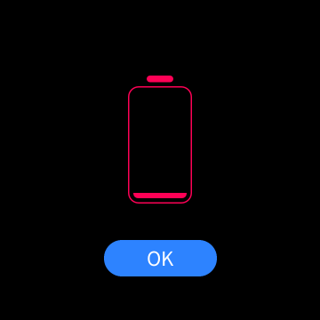 | Critically-low-battery warning (before the battery sysfs fix) |
| 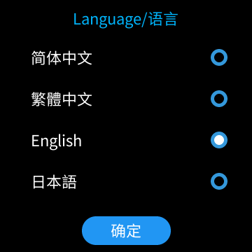 | First-boot language wizard, **English** selected (options stay in their native scripts; the 确定 button is the fallback locale until you confirm) |
| 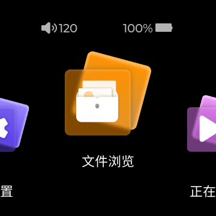 | **Main menu** carousel (Settings / Browse files / Now playing), battery 100%, volume 120 |
| 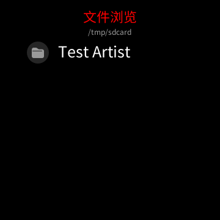 | **File browser** at `/tmp/sdcard` showing the `Test Artist` folder from `./sdcard` |
| 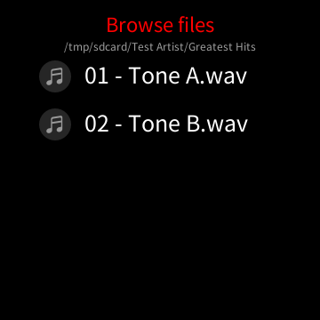 | Two levels in — `/tmp/sdcard/Test Artist/Greatest Hits` listing the `.wav` tracks |

## Current controls — screenshots from 2026-09-11

These are actual emulator/browser captures, not mockups. Permanent copies are in
`docs/images/`; diagnostic captures in ignored `shots/` are not required to reproduce them.

| | Verified screen |
|---|---|
| 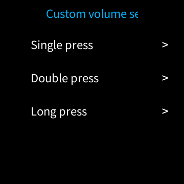 | Stock **Custom volume settings**: Single press, Double press, Long press. All three assignments were changed through this app and restored to 1 / 0 / 1. |
| 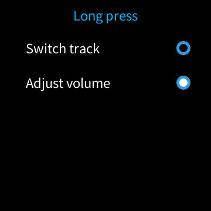 | Stock **Long press** action selection; **Adjust volume** restored after testing Switch track. |
| 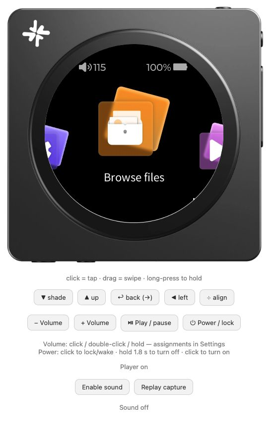 | Updated viewer with Volume −/+, Play / pause and Power / lock, plus gesture instructions and device status. |
| 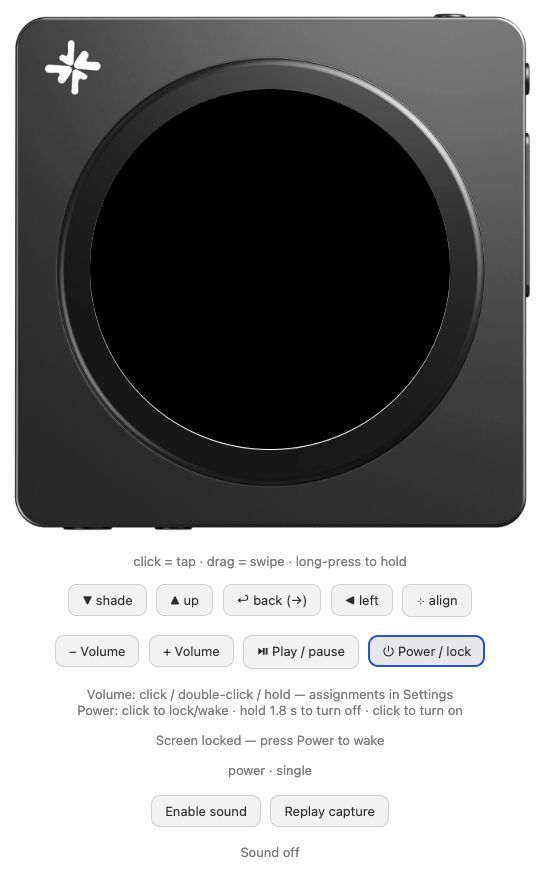 | Power short-click: screen is black, status reports locked, touch requests return HTTP 409. A second click wakes the stock UI. |

Checks passed: **16 Python tests + 7 JavaScript tests**, plus live guest state readback,
browser click/double-click, GPIO holds, settings changes/persistence, DAC gain, and an
off/on cycle. Viewer screenshots were captured from the actual browser page.
The full track/position/gesture matrix and physical-device timing were not exhaustively tested.

## Network and library checks — 2026-09-11

| Actual browser capture | Result |
|---|---|
| 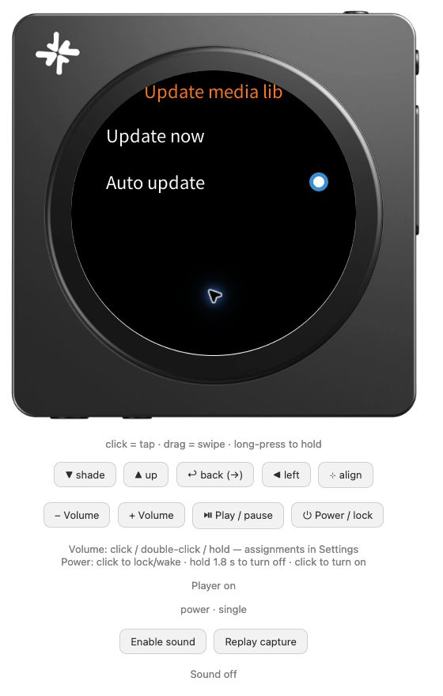 | **Update now / Auto update** in the stock application. The indicator alone is not proof that automatic scanning is enabled or implemented. |
| 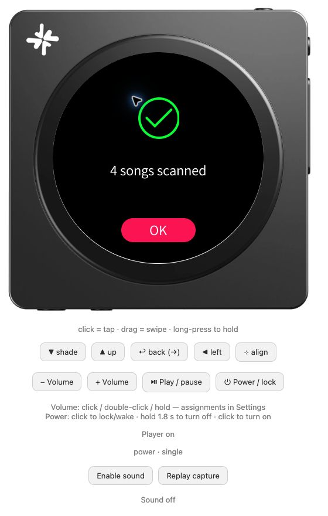 | **4 songs scanned**, using the stock scanner after the mount-source fix; all four returned by TCP 0401. |
| 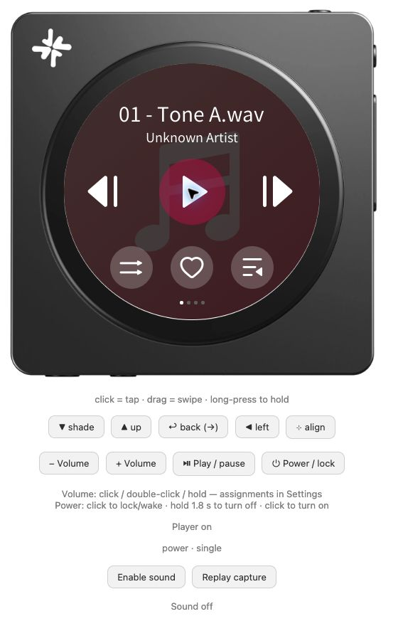 | **01 - Tone A.wav**, selected through TCP from the indexed library, left paused after the play/pause test. The central Play icon agrees with wire state 1 and internal state 2. |

Passed: **28 Python tests + 7 JavaScript tests**, Compose validation, image rebuild /
container recreation, repeated setup/boot and viewer Power-on. The live host check
`python3 tools/verify_network.py --control --start-library` verifies protocol 3.06,
volume **119 → 118 → 119**, the same track's wire state **0 → 1 → 0**, and HTTP 12103.
The test leaves playback paused. Guest memory independently confirmed volume 119,
player state 2 (paused), network-ready=1, Docker IP and dropped dangerous capabilities.
Automatic scanning did not ingest the fifth test file; WebSocket returned 200 instead
of 101. Those are recorded limitations, not passing checks.

## Skin controls and WebSocket findings — 2026-09-11

| Actual browser capture | Result |
|---|---|
| 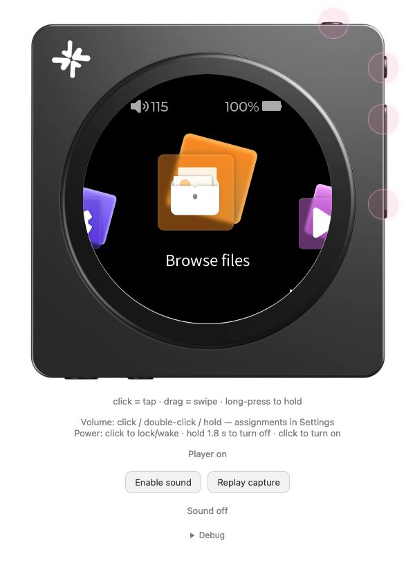 | Physical controls on the skin: translucent pink circles, no icons at rest. Power is centered over the top button; Play/pause and the volume rocker are on the right. Gesture shortcuts and alignment are hidden in collapsed **Debug**. |
| 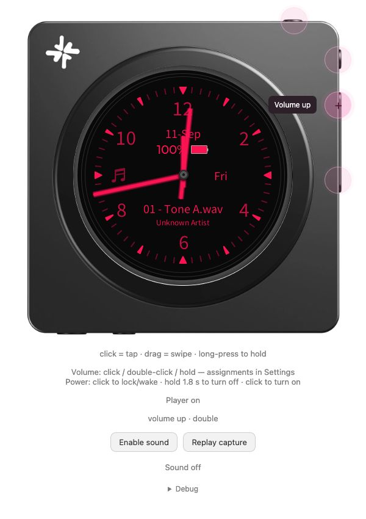 | Hover reveals the icon and label; focus/pressed feedback remains available. Volume changed **115 → 114 → 115**, with DAC gains **0.37584 → 0.35481 → 0.37584**. |

Passed **37 Python + 10 JavaScript tests**. Live browser clicks verified volume,
Power startup/wake and play/pause (internal state **2 → 1 → 2**, left paused).
Confirmed hover CSS: fill alpha 0.13/icon opacity 0 at rest, 0.32/1 on hover.
Debug expands/collapses; closing it clears alignment mode and its readout.
Automated checks cover keyboard feedback, pointer/blur cancellation, duplicate-click
suppression, a second finger's release and plain/skin HTML generation. Mobile layout
and the no-skin fallback were not visually tested in this session.

**WebSocket diagnosis is complete, but stock WS control does not work:** the active
12103 callback `004b9d38` dispatches a 16-entry HTTP table with no WebSocket route.
Unknown URLs go directly to empty HTTP 200 (`0048f8f8`). `/api/websocket` and a made-up
URL returned the same result. The older explanation involving a dashboard password
was incorrect; the bundled dashboard handler is not connected to this listener.
Read-only route inspection and strict upgrade probes are committed; see
[NETWORK.md](NETWORK.md#websocket-investigation). No binary patch, new dependency,
port or ad-hoc image change was made. Dockerfile/Compose remain unchanged for this step.
The existing viewer startup script applies the UI changes: `./run.sh view`, then reload.

## Working WebSocket bridge — 2026-09-11

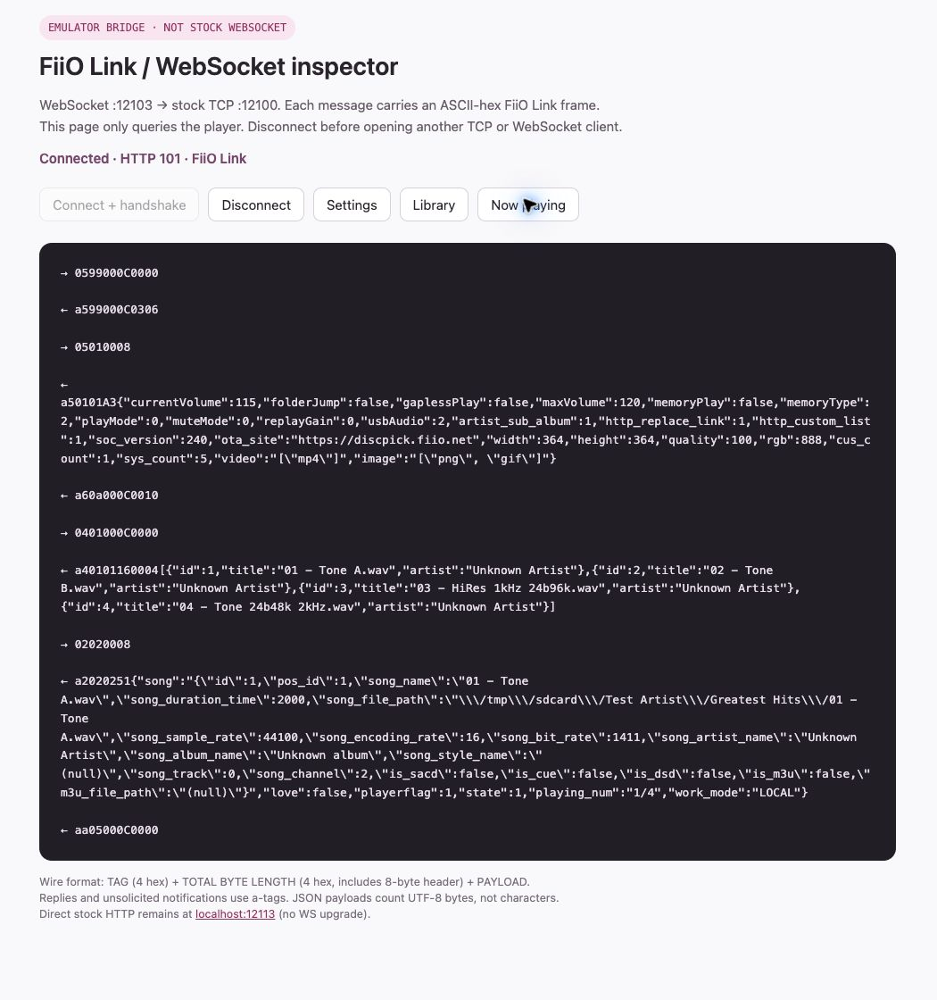

Actual browser WS frames: `0599000C0000` → `a599000C0306`, settings, four indexed
tracks, Tone A metadata with paused state 1, plus unsolicited a-tag notifications.
The read-only inspector at **http://localhost:12103/bridge/** clearly identifies the
emulator bridge. It was disconnected after capture to free the single-client channel.

**55 Python + 10 JavaScript tests passed**, plus repeated `./run.sh wscheck --control`:
TCP/WS settings/catalog equal; volume **115 → 114 → 115**; same track playing → paused;
second WS rejected with 409; reconnect handshake 0306. Independent guest probe showed
volume 115 and internal paused state 2. Host 12103 gives a valid 101, while direct
stock HTTP on host 12113 still gives 200. Browser Origin and real WS transport verified.
Docker image rebuilt and Compose recreated without deleting the work volume.
After recreating only the bridge, a powered-off guest correctly produced HTTP 503;
normal guest boot restored WS control and the full volume/playback/reconnect check passed.

Stock closes/reopens its TCP listener between clients. The bridge retries connection
refusal up to three seconds, never commands; the read-only TCP comparison also tolerates
handover. One early playback check ran after stock idle shutdown had set NO_WORK_MODE;
restarting the guest with its viewer supervisor restored playback, then WS control passed.
The emulator's idle-poweroff policy itself was not changed.

## Reproducible CI baseline — 2026-09-11

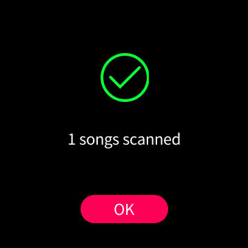

Actual screenshot from a **fresh disposable work volume**, not the interactive
four-track library. The stock scanner indexed one generated `CI Tone.wav`; TCP and
WebSocket returned that same track. Volume **120 → 119 → 120**, play/pause,
exclusive WS connection (409), reconnect (0306), and TCP/WS parity passed locally.
Fast carousel flings were nondeterministic, so CI uses a slow drag and scrolls the
Settings list to its end before selecting Update media lib → Update now.
The complete local clean-volume run also passed a byte-exact audio check: signed
16-bit stereo WAV becomes 32-bit / 44.1 kHz PCM, with two source periods found exactly.
All temporary stacks, work volumes, generated media and SD loop devices were cleaned up.

**67 Python + 10 JavaScript tests**, shell syntax and all four MIPS shim builds pass
in the pinned Debian image. Missing/skipped Python checks fail CI. The Docker base
digest and Debian/security snapshot are pinned, including native aiohttp and Node.
The full workflow uses a secret download URL, verifies the consumed rootfs SHA-256,
generates its own media and isolates containers/volumes/ports. See [CI.md](CI.md).

`2.x` is now GitHub's default branch; historical `main` is retained. The firmware-free
workflow passed on GitHub ([run](https://github.com/eudj1n/snowsky-disc-qemu/actions/runs/34602295491)).
The first hosted firmware run passed build/tests and the secret-backed download, but
the runner's old Docker Engine rejected Compose `interface_name` before guest startup.
Both workflows now explicitly install Engine 28.5.2 / Compose 2.39.4.
That rerun reached the real scanner/control checks and exposed a state-only `a202`
notification racing a now-playing reply. The verifier now polls read-only queries
for complete metadata and the expected state/track, with a bounded timeout; it never
retries play/pause commands. Four regression tests cover this behavior.
**Both hosted workflows passed on commit `bf54fa0`**:
[firmware-free CI](https://github.com/eudj1n/snowsky-disc-qemu/actions/runs/34603213882)
and [fresh V2.40 integration](https://github.com/eudj1n/snowsky-disc-qemu/actions/runs/34603214877).
This includes the private download, verified rootfs, stock scan, TCP/WS controls,
byte-exact PCM and cleanup on an amd64 hosted runner; the same flow passed locally
on arm64. After the Node.js 24 action upgrade and Dependabot setup, both workflows
also passed on release commit **`e3aab81`**:
[CI](https://github.com/eudj1n/snowsky-disc-qemu/actions/runs/34603924267) and
[firmware integration](https://github.com/eudj1n/snowsky-disc-qemu/actions/runs/34603924295).
The CI job has no Node.js 20 deprecation annotations; the firmware run uploaded zero
artifacts. Dependabot's initial jobs passed and opened
[PR #1](https://github.com/eudj1n/snowsky-disc-qemu/pull/1), retaining full SHA pins;
the major checkout update is left for separate review, not automatically merged.
GitHub immutable
releases are enabled. Branch protection/rulesets returned HTTP 403
because the private repository's current plan does not support them; visibility was
not changed. The initial OAuth `workflow`-scope blocker was resolved by the owner.
**[v2.40](https://github.com/eudj1n/snowsky-disc-qemu/releases/tag/v2.40) is published**,
with an annotated tag at `e3aab81dc50acbd11c1939b920fbd2cd8abf9a12`, immutable release
enabled and no uploaded assets. It is an emulator source baseline, not a flashable
firmware package. This status-only follow-up does not move the tested release tag.
V2.57 remains the next migration target.

The repository has been renamed to **`eudj1n/snowsky-disc-qemu`** and `origin` updated;
it remains private, with `2.x` as default. Local directory and Docker image/container/
volume names remain unchanged to preserve state. Public-facing documentation cleanup
and investigation of other ECHO-based products are deferred to separate work.

## Not done yet / next

- **V2.57 — clean baseline works; feature acceptance pending.** Two isolated local runs
  passed boot, stock library scan, TCP/WS (`soc_version:257`) and byte-exact PCM.
  Physical volume single/hold, media play/pause, screen sleep/wake and BusyBox reboot
  shim binding also passed. V2.40 remains the default and its interactive volume is untouched.
  Profiles check product/version, six binary hashes and the one allowed key patch;
  key/network/HTTP diagnostics now support both exact builds ([details](DIAGNOSTICS.md)). Downloader/workflow select each version
  explicitly. Firmware-free suite: **88 Python + 10 JavaScript tests**, shell syntax and
  four shim builds. See [2.57 report and new screenshots](firmware/2.57.md),
  [PORTING](PORTING.md) and [CHANGELOG](../CHANGELOG.md). FW257 feature cases and full
  key-reassignment combinations are still untested; no V2.57 release tag yet.
  The expanded clean integration also passed again on **V2.40**, including its physical
  controls and reboot binding, after introduction of the version-aware profiles.
  Hosted checks also passed on `0202310`: [firmware-free CI](https://github.com/eudj1n/snowsky-disc-qemu/actions/runs/34608267517),
  [V2.57](https://github.com/eudj1n/snowsky-disc-qemu/actions/runs/34608271179),
  [V2.40](https://github.com/eudj1n/snowsky-disc-qemu/actions/runs/34608267536).
  V2.57 firmware integration uploaded zero artifacts. These evidence links are a
  documentation-only follow-up to the tested code commit.
- **Public release preparation** — MIT selected; the owner confirmed skin-photo authorship.
  Root README no longer prints the OTA password or refers to private projects;
  instructions moved to `AGENTS.md`. Visibility is still private. History/tag/log and
  screenshot review remains necessary before publishing; see [PUBLIC_RELEASE](PUBLIC_RELEASE.md).
- **Additional audio routes** — USB/BT, DSD, and hardware-accurate timing still need separate
  validation. Local PCM works; see [AUDIO.md](AUDIO.md).
- **Auto update (media library)** — the menu option was inspected/clicked, but adding a
  generated fifth WAV and rebooting did not update the index or start a scan. Its effective
  on/off state and startup/hotplug trigger are not yet established. Manual Update now works.
  The fixture was removed and SD rebuilt; the original four indexed tracks remain.
- **Remaining network work** — LAN multicast discovery, FiiO Control phone-app
  compatibility, Wi-Fi association and cloud streaming. The local WS→TCP bridge works;
  stock V2.40 still has no registered WS route. `POST /audio/` is an active HTTP
  route worth investigating separately for file transfer. Automatic OTA/NTP helpers
  are blocked; OTA downloads/installations were not tested.
- **Carousel swipes** — ✅ done via the viewer's drag/`/swipe` (intermediate position events
  over time).
- **Power fidelity** — viewer power-off is a deliberate guest-only process stop, not stock
  standby/shutdown policy or its animation. Raw firmware `0x108` is blocked in the viewer
  because it invokes stock shutdown side effects. Automatic poweroff's libc reboot call
  is now intercepted too; hardware-accurate standby/MCU behavior and a security sandbox
  for arbitrary direct syscalls are not implemented. See [KEYS.md](KEYS.md).
- **MCU/UART** — the FiiO MCU (`/dev/ttyS*`) is absent; not required to reach/use the main
  screen; MCU-specific behavior such as charging reports remains unemulated. Physical
  key delivery itself uses `event0`, not UART (see [KEYS.md](KEYS.md)).
- **Other firmware versions / rendering paths** — last-buffer tracking is validated for
  V2.40's framebuffer memcpy path. The viewer retains its old heuristic as a fallback when
  an older shim supplies no marker. Standalone captures still export both raw sub-buffers.

See [EMULATION.md](EMULATION.md) for the how/why behind everything above.
