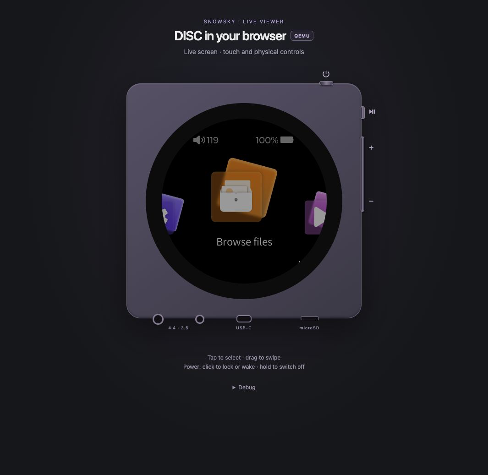

# Live viewer + touch bridge

`./run.sh view` turns the emulator into an **interactive** stand: it streams the guest
framebuffer to a browser and turns pointer events on that page into synthetic touches, so
you drive the real stock UI from the host with no hardware. A responsive CSS device
contains the live round screen, physical buttons and audio/USB/microSD connectors.
The **QEMU** badge distinguishes this host-backed Viewer from the
[WASM experiment](BROWSER.md), which uses the same page styling and device geometry.



*Actual browser capture, 2026-09-17: CSS device with live V2.57 screen and
physical, audio, USB and SD controls. Debug is collapsed.*

```sh
./run.sh boot          # start the guests (they now stay alive ~30 min, see GUEST_TTL)
./run.sh view          # -> http://localhost:8080   (add a port arg to change it)
```

Then, in the browser: **click = tap**, **drag = swipe**, **long-press = hold**, and the
gesture shortcuts are available in the collapsed **Debug** section.
They duplicate touch swipes and are not needed for normal use.

`DEVICE_BOOT_SCRIPT` in `.env` optionally selects the script invoked by viewer
Power when the guest is off. Leave it empty for the usual `/repo/emulator/scripts/20_boot.sh`.
An override is an absolute path inside the container, executed by Bash with the
selected `ROOTFS` and the existing 90-second startup timeout. Recreate the container
and restart the viewer after changing it. This does not change `./run.sh boot`.

The audio sockets at the lower left share the **Enable sound** control. Enabling browser audio
shows a plug in the 3.5 mm socket; clicking again mutes sound and removes the plug.
The 4.4/3.5 labels represent their physical locations; this shared browser audio
switch does not select a hardware output or inject stock headphone detection. **Replay capture** lives
inside **Debug** and starts the current recording again. Select tracks and pause in
the device UI. Volume remains controlled by the existing physical buttons and stock
menus; DAC attenuation already drives the browser audio gains. There are no extra sliders.

Brightness comes from the stock shade slider (1–40). The viewer observes the actual
backlight stub via device SSE and applies a CSS brightness factor to the screen image.
This approximates panel luminance; framebuffer pixels, lossless PNG transport and
animation cadence are unchanged. Backlight zero still displays a black frame.

Normal **Player on** status is hidden. Off/sleep status is centered
inside the dark screen; connection errors and transitions while the screen is lit
appear in a compact panel near the bottom of the screen. Peripheral errors appear
below the device.

The USB connector is centered on the bottom edge; the SD slot is to its right.
USB toggles a visible plug, a charging label and guest battery status
(`Charging` / `Discharging`). On V2.57 it also drives the stock USB-power detector
through narrow sink-role/ADC emulation, so the firmware can inhibit idle power-off
while plugged in. Cable state survives viewer/guest restarts. This is power-only
simulation: no USB storage/DAC mode or actual battery charging curve. Native
battery-icon rendering has not been separately validated. V2.40 retains only
the older cable/sysfs stub. See [idle power and USB scope](IDLE_POWER.md).

The SD control performs real guest card removal/insertion and sends a unicast stock
hotplug event only to this fingerprinted player. Removal first unmounts both emulated
card mounts without force, then hides their mmc nodes. A busy card is refused; stop
playback or turn the player off before retrying. This protects media from stock
mountpoint cleanup after a failed unmount. Insertion reattaches the same image (the
old loop number may have been released), restores the nodes, and waits for the stock
mount before preparing the helper mount. Cyrillic filenames and media hashes are
checked across repeated cycles in disposable integration tests. Insertion follows the
stock auto-scan gates described in [MEDIA_LIBRARY.md](MEDIA_LIBRARY.md).
An ejected card stays out across viewer/guest restarts; a full setup rebuilds it from
`./emulator/sdcard`. Host `./run.sh boot` includes that setup, so it also refreshes the card
from the host folder and replaces guest-only card changes. Viewer Power-on alone
does not rebuild it. The host media directory itself is never ejected or modified.
Each PCM session replaces the recording; `./run.sh audio` saves a WAV to `shots/audio.wav`.
See [AUDIO.md](AUDIO.md) for limits and verification.

## How it works

`viewer/server.py` runs inside the container (wrapped by `viewer/scripts/40_stream.sh`, launched
detached by `./run.sh view`) and serves:

| route | purpose |
|---|---|
| `GET /` | the viewer page (stream + pointer capture + gesture buttons) |
| `GET /device.css` | shared page and device styles |
| `GET /stream` | lossless PNG stream on pixel changes, plus a full idle refresh every 15 seconds |
| `GET /frame` | a single current PNG (handy for scripting) |
| `GET /audio.json` | capture generation/format/size, guest running state and DAC output gains |
| `GET /audio.pcm?generation=…&offset=…` | bounded PCM chunk at a frame-aligned offset |
| `GET /tap?x&y` | short tap at display coords (press, hold ~0.3 s, release) |
| `GET /down?x&y` · `/move?x&y` · `/up` | manual press / drag / release |
| `GET /swipe?dir=down\|up\|back\|left` (or `?x0&y0&x1&y1`) | server-side smooth swipe |
| `POST /button` JSON `{name, gesture}` | physical-button gesture; see [KEYS.md](KEYS.md) |
| `POST /peripheral` JSON `{name:"sd", inserted:bool}` or `{name:"usb", connected:bool}` | same-origin SD hotplug / USB charging simulation |
| `GET /device.json` | guest power, screen, backlight, peripherals and transition state |
| `GET /events` | SSE `device` snapshots on connection and state changes; idle heartbeat every 15 seconds |
| `GET /key?k=volume_up\|volume_down\|play_pause\|power` (or safe `?code=<int>`) | diagnostic single stock key event; use POST for power lifecycle |

The page subscribes to `/events` through `EventSource` instead of polling
`/device.json` every second. Each connection immediately receives current power,
screen, brightness, peripherals, transition and error state; unchanged state produces only SSE heartbeat
comments. The existing guest supervisor samples state every 200 ms and wakes all
subscribers on changes. Reconnection receives a fresh snapshot, and controls wait
for it before becoming available. Leaving the page closes the subscription;
returning from the browser back/forward cache opens one again. The JSON endpoint
remains available for diagnostic clients. Video still uses `/stream`; enabled
audio still fetches `/audio.json` and PCM chunks as before.

**Framebuffer** (see [EMULATION.md](EMULATION.md)): `fb0` is a plain file, three 360×360
BGRX sub-buffers. `mq_ui` alternates buf0/buf1 without panning. `fbshim` observes framebuffer
copies and records the last-written buffer in `emu/fb-live`; the background reader uses
that marker, converts BGRX→RGB + 180° rotation, and PNG-encodes it. Older shims fall back
to diffing frames, which can select a stale buffer if both changed between reads.
Brightness 0 or a stopped guest produces a black frame. Port published in `compose.yaml` (8080).

The grabber still samples at `STREAM_FPS` (default 12), preserving the existing
animation cadence. It reads only the two used buffers, checks the active marker
before and after reading, and retries a sample if that marker switches. This is
not an atomic framebuffer fence: the marker alone cannot detect every same-buffer
write, and the previous capture path already sampled asynchronously. It therefore
remains a selection hint combined with pixel checks, not a sole dirty notification.

Unchanged visible RGB is neither PNG-encoded again nor sent at frame rate. A changed
frame is encoded once for every connected viewer; switching buffers with identical
pixels and changes to unused BGRX bytes do not produce redundant images. Lock/wake
still publishes black/restored frames even without a guest framebuffer write.
Idle connections receive the cached full PNG every 15 seconds to refresh the image
and detect disconnected readers (180 times fewer steady-state sends than 12 fps).

Each part is a complete 360×360 lossless PNG. `frames.js` reads each PNG by its
Content-Length, preloads a PNG Blob URL with `Image.decode()`, and replaces the
displayed image as soon as it is complete. Native multipart image decoding could leave a
rarely updated image blank while waiting for subsequent parts; explicit decoding
avoids that dependency. There are no delta frames or reference-frame chains.
The browser retains at most one frame being decoded and one latest pending frame;
obsolete connection decodes are discarded and replaced Blob URLs are revoked.
The currently displayed URL remains valid until a complete replacement is ready.
Slow consumers read the latest available snapshot;
the server keeps no application frame queue and bounds blocked writes to 5 seconds.
Socket/browser buffering still exists; this does not promise hard realtime or A/V
clock synchronization. Transport/decode errors and SSE reconnection restart the image stream
with a complete current frame. Page exit closes it; back/forward-cache restoration
reconnects. Audio transport and capture timing are unchanged.

Local V2.57 measurement on an unchanged main screen: the previous server sent 60
identical 37,985-byte PNGs in 5 seconds (2,282,760 bytes including multipart headers).
The changed-frame server sent one PNG in the same interval (about 38 KB), with the
same SHA-256. After the initial frame, the 15-second idle refresh corresponds to
about 9.1 MB/hour instead of 1.64 GB/hour for that particular screen. Animated
screens still send changed full frames at the configured capture rate; these idle
savings are not a prediction for continuous animation.

**Touch** (see [TOUCH.md](TOUCH.md)): pointer coords are mapped to the 360² screen, flipped
to raw touch (`359−x, 359−y`), and appended to `/dev/input/event1` as `input_event`s. A plain
click uses `/tap` which holds ~0.3 s (the read-cb drains all queued events per poll, so a
press+release in one batch is seen as a net release = no tap). A drag sends `down → move… →
up` over real wall-clock time, which is also how **swipes** work — the shade pull-down and the
left→right back gesture are just server-side interpolated swipes, one click each.

## Device layout

The body, buttons and connectors are drawn with HTML/CSS in
`viewer/static/index.html` and the shared `viewer/static/device.css`.
The [browser prototype](BROWSER.md) copies the same stylesheet into its build.
The live framebuffer remains a 360×360 image, displayed at its native CSS size
on wide screens. On narrow screens it scales down with normal image smoothing;
pointer coordinates map back to the original display pixels. No photo, overlay coordinates,
`SKIN_*` environment settings or alignment mode are needed. The old `/skin` route
and `cx`/`cy`/`d` geometry query parameters have been retired.

The body keeps the physical DISC’s square proportions, with its round screen and
flat black bezel centered on the face. Power is on the top edge; Play/pause and the volume
rocker are on the right edge. The bottom edge carries the two audio sockets,
USB-C and microSD in the order shown in the
[official quick guide](https://fiio-instruction.fiio.net/%E5%BF%AB%E9%80%9F%E5%85%A5%E9%97%A8/2025/DISC.pdf).
There is no lettering or logo on the face. Small control symbols stay visible;
hover lights the icons and reveals button names; keyboard focus also underlines
the icon or port label. No rectangular button highlight is drawn. Connected audio/USB ports show plugs,
and the SD slot changes to a card icon when ejected. Each control also has an
accessible name and state. Space/Enter, pressed feedback, cancellation on pointer
loss and the existing single/double/hold gestures are preserved. Reduced-motion
preferences disable transitions. Debug contains gesture shortcuts and audio replay.

For these HTML/CSS and server changes, run `./run.sh view` and reload the browser;
a guest reboot or image rebuild is unnecessary. The historical owner photo remains
in `viewer/assets/` with its provenance, but is no longer loaded by the viewer.

## Notes / limits

- Needs `./run.sh boot` first; until then the page is black (boot in another shell and watch
  it come up). `./run.sh stop` also stops the viewer.
- FPS is qemu-bound (~5–15). This is a userspace emulator — good for UI/navigation/logic, not
  hardware-accurate timing.
- **Physical controls**: Volume −/+ support single/double/hold, with assignments in the
  app's Custom volume settings. Play / pause is a short click; stock long/double play
  gestures have no playback action. Power short-click sleeps/wakes the screen; hold 1.8 s
  to stop the guest, then click to boot it again. Screen-off blocks touch but not
  physical media/volume controls. Space/Enter works on focused buttons. See [KEYS.md](KEYS.md).
- Startup has no fixed 26-second pause: the boot script waits for the stock network
  listeners, both guest input devices (`mq_ui` touch and `mq_player` keys), and a new
  framebuffer flush, then remounts the SD card. The viewer enables controls when that
  script completes; this is an emulator readiness check, not a firmware "ready" message.
  Input/frame readiness has a 60-second timeout with an error instead of false success.
  An explicit `./run.sh boot <seconds>` adds a diagnostic delay before capture.
- The screen uses a pointing-hand cursor for taps and a grabbing hand while pressed;
  cancelling a drag releases the touch and restores the cursor.
- Viewer power-off is host-managed, not the stock standby/shutdown sequence. It leaves the
  container and viewer alive. The dangerous raw firmware power event `0x108` is rejected.
  Stock automatic poweroff is also confined by a libc reboot interposer and guest-only
  shutdown requests. This is not a general sandbox for arbitrary firmware syscalls.
- Update both guest shim and server after installing changes: `./run.sh boot`,
  `./run.sh view`, then reload the page. Reloading alone cannot update a loaded shim.
