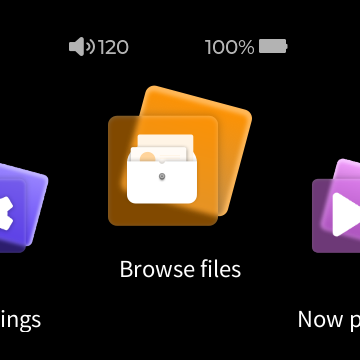

# Firmware V2.57 intake and acceptance

Status: **clean baseline validated locally and on GitHub; upstream-feature acceptance still pending**.
V2.40 remains the default; its working image and immutable tag are unchanged.

## Inputs and observed facts — 2026-09-11

- Archive: `SNOWSKY_DISC_update_20260909_v257.zip`; secret `FIRMWARE_V257_URL` is present.
- `ota_config.in`: main OS **257**, recovery **18** (previously 240 / 17).
- [Machine-readable inventory](../../firmware/inventory/v2.57.json), generated using
  `tools/firmware_inventory.py` with the pinned Docker image and both local inputs.
- ZIP: **105,680,009 bytes**, SHA-256
  `2bfad000609440bcbf492468e9e5f8f3d5e0bade797323431a15b5755688bfcf`.
- Rootfs: **77 chunks**, **80,596,992 plaintext bytes**, SHA-256
  `111e4dd7ee3d7ff91ba7e61181690be7ffd22bd1bbd13ad513f5f015ffb302ae`.
- Encrypted rootfs chunks match their manifest and their ZIP counterparts; version
  config matches the ZIP. AES-256-CBC/PBKDF2 decryption yields SquashFS. No plaintext
  file was written and no firmware was executed by this operation.
- Signature authentication was **not** performed. No explanation for the smaller rootfs
  is claimed before content comparison. The public V2.57 release-page URL still needs confirmation.

## Static comparison and guarded bring-up — 2026-09-11

Exact hashes are in [the runtime profile](../../firmware/v2.57.json), with V2.40
retained separately. Both rootfs trees were extracted into network-disabled research
containers/volumes; the interactive `diskos-work` volume was not used.

| Observation | V2.40 | V2.57 |
|---|---|---|
| Buildroot revision | `03058-gb2b3ca4-dirty` | `03166-ge3b468a-dirty` |
| Player entry point | `0x4078a0` | `0x407f20` |
| Key dispatcher | `0x4de6fc` | `0x4e72f0` |
| Key guard VA / file offset | `0x4de70c` / `0xde70c` | `0x4e7300` / `0xe7300` |
| Key config base | `0x82e980` | `0x83a740` |
| Player ABI | ELF32 LE MIPS, o32, nan2008, MIPS32r2 | Same |
| Loader, glibc, tinyalsa | Pinned hashes | Byte-identical |
| Player, UI, BusyBox | Pinned hashes | All changed |

The new guard remains `lbu v0,65(s2)` followed by a branch rejecting disabled keys.
The same dispatcher checks event value 2 and dispatches the custom 250..269 code range,
including the assignment bytes at offsets 82..84. These surrounding instructions, not
an assumed uniform address delta, identify the site. Native `readelf -l` confirms its
file mapping; `objdump -d` reproduces the comparison. The patch is still one instruction
(`lbu` → constant 1); full normalized stock SHA-256 validation precedes every write.
BusyBox still dynamically imports `reboot`; integration additionally verifies it binds
to `fbshim` with `LD_DEBUG=bindings` and `LD_BIND_NOW=1`, without requesting a reboot.

Two local clean V2.57 runs passed the UI/scan/TCP/WS/PCM baseline. The second also passed
physical volume single/hold, media play/pause, screen sleep/wake and reboot binding.
The generated WAV was indexed by the actual UI scan, returned via TCP/WS, and decoded
to byte-exact stereo 44.1 kHz / 32-bit PCM. Protocol handshake remained `0306` and
settings reported `soc_version: 257`. Temporary stacks, SD loops and test volumes were
cleaned up; static research volumes remain local for further analysis.
The same expanded integration subsequently passed on V2.40 as a regression check.

Hosted evidence on exact code commit `020231020a0cd3d161b61735b70e399d28706e90`:
[firmware-free CI](https://github.com/eudj1n/snowsky-disc-qemu/actions/runs/34608267517),
[fresh V2.57 integration](https://github.com/eudj1n/snowsky-disc-qemu/actions/runs/34608271179)
and [V2.40 regression](https://github.com/eudj1n/snowsky-disc-qemu/actions/runs/34608267536)
all succeeded. V2.57 used its configured secret-backed archive and produced no uploaded
artifacts. Local checks ran on arm64; these hosted checks ran on amd64. Documentation
links were added afterwards without changing the tested runtime code.

Reproduce using [the version-selected integration command](../CI.md). No new Docker
packages were needed; extraction/profile/test changes are tracked scripts, and Compose
passes `FW_VERSION` explicitly. This is baseline compatibility, **not** a V2.57 release
or validation of all new features. Double-click/reassignment combinations
and the new features below need separate work. Internal diagnostics have since been
ported; see [DIAGNOSTICS.md](../DIAGNOSTICS.md).

## Upstream notes → acceptance checklist

Source: release notes supplied by the repository owner on 2026-09-11. These are
**upstream-reported changes**, not verified emulator features. Keep IDs stable so
test names, screenshots and later findings can refer to them.

| ID | Reported change | Required check | Status |
|---|---|---|---|
| FW257-01 | Large / Medium / Small system fonts | All sizes, persistence, layout/clipping and touch targets | Not tested |
| FW257-02 | Connected Wi-Fi details through `!` | Details screen and data; distinguish Docker network from real Wi-Fi association | Not tested |
| FW257-03 | Thai/Czech/other ID3 tags and lyrics; BT ID3 sending | Generated multilingual metadata/lyrics fixtures; separate physical BT check | Not tested |
| FW257-04 | Configurable list gestures for index / batch operations | All four long-press / swipe-left assignments, persistence and conflicts with navigation | Not tested |
| FW257-05 | FiiO Link Favorites track mismatch and AUTO EQ no-output fixes | Favorites order/ID readback; independently check AUTO EQ PCM output | Not tested |
| FW257-06 | MP3 progress after seek | Generated MP3, seek positions, reported progress versus decoded output | Not tested |
| FW257-07 | External cover art fixes | Reproducible filenames/formats and actual rendered cover | Not tested |
| FW257-08 | USB AUDIO ID3 refresh after gapless auto-advance | Separate USB-output validation; no hardware claim from local PCM tests | Not tested |
| FW257-09 | CD number UI, M3U import and other UI fixes | Disc-number fixture, playlist path/encoding matrix; unspecified fixes remain unverified | Not tested |

## Remaining acceptance and release work

### Cyrillic paths — verified locally, 2026-09-11

The corrupted Cyrillic folder/file names were an **emulator SD-image creation
bug**, reproduced without running firmware. On the arm64 Docker host, the initial
`mount -o loop` selected `iocharset=iso8859-1`; copying UTF-8 names through that
mount wrote incorrect FAT long names. The later guest mount used `iocharset=utf8`
and exposed mojibake. MP3/cover SHA-256 values remained identical to the originals.

Image creation now explicitly mounts with `-t vfat -o loop,iocharset=utf8`, matching
the guest. Rebuilding the interactive SD preserved the original Cyrillic names
and file hashes. The stock Browse files UI displayed and opened the Cyrillic
directory and MP3; TCP returned the correct full path and playing state. The track
was left paused. No firmware or font patch was needed.

The clean integration fixture now uses
`Кириллица Ё й/CI Tone — Проверка.wav`. Before scanning, the check opens this exact
path on the guest SD and compares its bytes with the source. A fresh disposable
V2.57 run passed stock scanning, TCP/WS playback (correct Unicode path in the
now-playing result), byte-exact PCM, physical controls and reboot-shim binding;
the temporary stack and volume were removed. These results are local on `096428a`
plus the working-tree SD/fixture changes, not a new hosted/release validation.
This establishes Cyrillic filesystem paths; the broader FW257-03 multilingual
metadata/lyrics/BT acceptance remains pending.

### Diagnostic port (2026-09-11)

Key/player state, network/storage/scan fields and the active HTTP table now have
separate exact-build profiles for V2.40 and V2.57. Local clean integration compared
their readbacks with TCP, SQLite and sysfs on both versions. V2.57's table has 17
entries: the new pair is `POST /image/`; `GET /log/` already existed in V2.40.
No stock WebSocket route was found, and direct Upgrade still returned empty HTTP 200.
See [DIAGNOSTICS.md](../DIAGNOSTICS.md) for addresses, derivation, commands and checks.
These local working-tree results do not replace the hosted release gates below.

### Release checklist

1. Keep running both profiles through hosted CI on each release candidate; retain V2.40 coverage.
2. Runtime key/network probes and active HTTP routing are now ported by strings/xrefs
   and exact-build profiles. Retain their integration checks; the legacy output-device GDB probe
   still requires separate porting when needed. See [diagnostic evidence](../DIAGNOSTICS.md).
3. Exercise all physical-button assignment combinations through the stock app.
4. Implement and run FW257 feature cases with generated fixtures and actual UI readback.
5. Update this report with observed results and links, then the emulator changelog.
   Publish `v2.57` only after its own exact-commit release gates pass.

Detailed method and evidence format: [PORTING.md](../PORTING.md).
