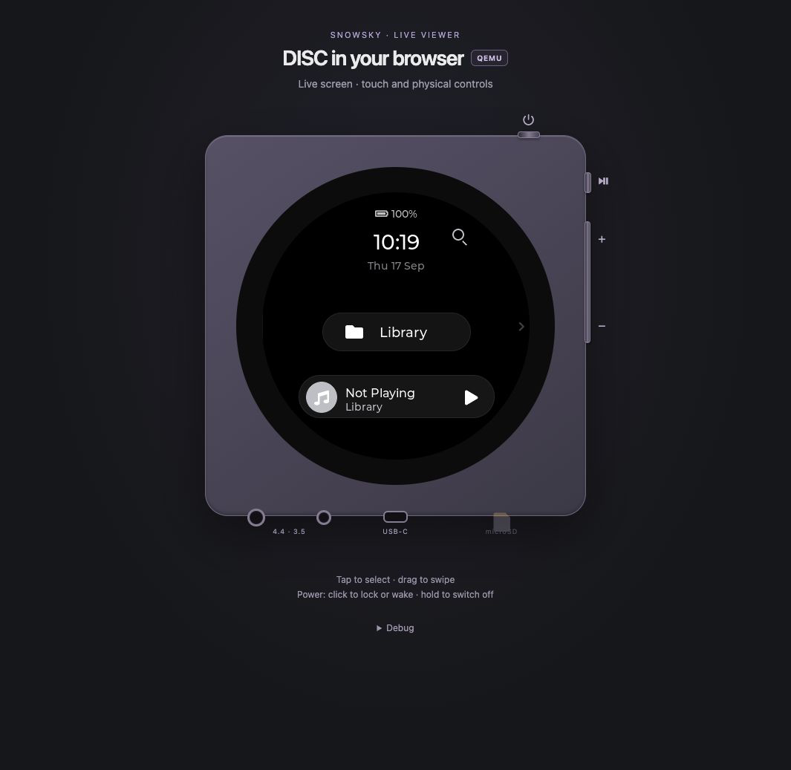

# diskOS UI preview — historical, unsupported experiment

This preserves the experiment recorded on **2026-09-13**, using stock **V2.40**
and diskOS commit `85a327ca56af2676c850f24ddcba5f34135132d4`. It is not part of the
supported emulator runtime and has no promised maintenance or recurring firmware
acceptance. The active supported stock firmware remains selected by
`firmware/active-version` (currently V2.57).

The source was recovered from experiment commit
[`1adb3e4`](https://github.com/eudj1n/snowsky-disc-qemu/commit/1adb3e454c03b53d22b5d1d0a0682cd8bd36bb57).
The preserved implementation lives in `experiments/diskos/`; this migration updates
repository paths, package imports and the CI image name. It retains the pinned
upstream source and warm-start adaptation, and now rejects firmware other than
the historically verified V2.40. A fresh build and startup with the current layout
were checked for the screenshot below on 2026-09-17. The full playback and
Power-cycle acceptance has **not** been repeated; those results remain historical.



*Actual emulator capture, 2026-09-17: diskOS `85a327c` over the stock V2.40 backend,
shown in the current CSS Viewer. The player is idle, with no media imported.
Brightness was set to maximum through diskOS's own quick panel.
[Capture details](../../../docs/images/README.md#diskos-v240-preview-2026-09-17).*

## Source-built UI preview

The experimental preview runs diskOS's **GPL-3.0-or-later UI** alongside the verified
stock `mq_player`. It does not run the installer or build/flash a NAND image.
[Issue #1](https://github.com/b0hemia/diskos/issues/1) concerns the installer's image
size limit; that limit does not apply to an extracted rootfs and a separately loaded UI.

The UI is static musl, so `/etc/ld.so.preload` cannot provide its framebuffer ioctls.
`experiments/diskos/emu_io.c` is linked with `--wrap=ioctl`: it supplies the emulated
360×360 framebuffer and marks page zero for the viewer. diskOS's own partial
renderer and IPC framing remain unchanged. The stock binaries retain their original
paths and normal fingerprint validation. `experiments/diskos/boot.sh` boots the stock
pair first, then replaces only the running UI with `/usr/data/mq_ui`. This is a
warm UI handoff, **not** a validation of diskOS's hardware cold-boot installer.

The launcher invokes QEMU with `-0 mq_ui` to avoid diskOS's argv-normalisation
self-exec loop under binfmt. One source adaptation in the **build copy** is enabled
by `DISKOS_EMU_WARM_PLAYER`: skip the redundant V2.40 startup route reinitialisation
when the backend was already initialised by the stock UI. Without the flag the
upstream logic remains active. Do not reuse this launcher for a cold backend.

The builder archives the exact commit in `experiments/diskos/source-revision` from the
local repository. Local edits, untracked files and `config.mk` are not used. Fetch
that commit if it is missing; change the pin only after reviewing and testing the
new source. The build copy retains the emulator adaptation and corresponding source.

Verified with diskOS commit `85a327ca56af2676c850f24ddcba5f34135132d4` and stock **V2.40**:

- Main screen, touch navigation through Library → Songs, and the UI's own SD scan.
- A WAV under a Cyrillic directory/filename is indexed and played. Cyrillic glyphs
  appear as boxes in the supplied diskOS font; this is separate from path handling.
- Stereo 44.1 kHz / 32-bit PCM contains byte-exact periods of the generated WAV.
- Viewer Power off/on returns to diskOS through the dedicated boot script.

Playback control experiment (2026-09-13): a separate container with **no published
ports and no browser clients**, fresh V2.40 state and the same 30-second WAV:

| UI startup | Captured PCM | Result |
|---|---:|---|
| Upstream logic + framebuffer adapter | 9.01 s | Stops when `v2.40 workmode: local-init sent once` appears |
| Warm-player adaptation enabled | 30.15 s including padding | Entire track completes; source waveform verified |

Browser Enable sound only reads PCM into Web Audio; it sends no player command.
The controlled reproduction rules it out as the cause of this interruption.

Known separate limitation: after rebooting with a previously selected track,
selecting that same entry again stopped a control run after about five seconds.
The diskOS start-confirmation timeout/recovery path still needs investigation;
this is not covered by the warm-start timer fix. Resuming through Play/Pause worked.

V2.57, hardware installation, Wi-Fi/BT, USB modes and diskOS's own system-restart
menu are not validated by this preview. In particular, do not interpret the
framebuffer adaptation or successful playback as evidence of safe NAND flashing.

## Preserved reproduction workflow

These commands are adapted to the current repository layout, but their execution
is optional research work. They depend on the legacy V2.40 runtime profile still
being present; preserving this experiment does not extend that profile's support
or prevent its future removal. Keep the original experiment commit as the
historical reference if runtime interfaces change.

From the repository root (Docker and Compose ≥2.36 required):

```sh
docker build -t snowsky-disc-qemu-ci emulator/docker

# Use matching, already downloaded official firmware chunks.
export FW_VERSION=2.40
export OTA_DIR=/absolute/path/to/main_os/ota_v240
preview() {
  docker compose --env-file /dev/null -p diskos-preview \
    -f experiments/diskos/compose.yaml "$@"
}
mkdir -p work/diskos-preview/sdcard
# Populate with your media, or create our generated test tone (once):
docker run --rm --network none -v "$PWD:/repo:ro" \
  -v "$PWD/work/diskos-preview/sdcard:/fixtures" snowsky-disc-qemu-ci \
  python3 -B -m tests.fixtures.fixture /fixtures
preview up -d
preview exec -T emulator bash /repo/emulator/scripts/00_extract_rootfs.sh /ota  # new volume only
preview exec -T emulator bash /repo/emulator/scripts/10_setup_env.sh
bash experiments/diskos/build.sh /absolute/path/to/diskos
preview exec -T emulator bash /repo/experiments/diskos/boot.sh
preview exec -d emulator bash /repo/viewer/scripts/40_stream.sh
```

Open <http://localhost:8081>. The usual viewer on 8080 and its `snowsky-disc-work` volume
remain separate. This stack publishes only the viewer, not the stock network
services. The viewer's Power start uses `boot.sh` again. Guest lifetime is
four hours by default; override `GUEST_TTL` when creating the preview container.

Build outputs and the copied GPL sources remain under ignored
`work/diskos-preview/`; no diskOS or vendor binaries are committed here. The
upstream builder verifies its musl toolchain download by SHA-256. Keep the copied
source and adapter with any emulation binary you share; it is not a flash payload.

To stop, release this stack's SD mounts first:

```sh
preview exec -T emulator bash /repo/ci/cleanup.sh
preview down
```

The named volume preserves its configuration and library. On subsequent starts,
run setup, diskOS boot and viewer commands; omit extraction. `down --volumes`
discards this preview's guest state. Use a separate volume for each firmware.

## Preservation checks

Migration validation on 2026-09-17 passed:

- 312 Python tests, 33 JavaScript tests, shell syntax and all four standard shim builds.
- Python syntax, 146 local documentation links and Compose rendering with explicit
  V2.40 inputs, the current repository mount, a dedicated volume and localhost-only 8081.
- Launcher rejection without the isolated-preview flag and on V2.57 before boot.
- Warm-start patch application to its expected anchor and rejection of changed
  source without modifying it; the adapter, patch and upstream pin are byte-identical
  to the original experiment.

These checks do not repeat the historical playback or Power-cycle acceptance and
do not promote this to a supported runtime.

Screenshot refresh on 2026-09-17 separately verified a build from the pinned
source, fresh V2.40 setup (including all six stock fingerprints), the warm UI
handoff, main-screen rendering, and opening/closing the quick panel to set
brightness. This used the isolated preview stack on localhost:8081 with an empty
media directory. No playback, library scan, Power cycle or hardware features were
retested. The preview was stopped after capture; historical/unsupported status
and the known limitations above are unchanged.

## Revisit the status

The historical/unsupported label describes the current checkpoint, not a
permanent decision. It can become an active **experimental** integration when:

1. Upstream supports the firmware currently validated by this project, and the
   known playback problems have reviewed fixes. Recheck the font limitation too;
   resolved and remaining issues must be stated separately.
2. A new exact upstream commit is pinned and its changes are reviewed, including
   whether the warm-player adaptation is still needed. Update the firmware guard
   only with a reviewed runtime profile; never fall through to an unknown version.
3. A fresh isolated run with the current repository verifies menu/touch navigation,
   library scan, Cyrillic paths, complete-track PCM playback, selecting the same
   track after restart, and the viewer's stop/start and screen lifecycle. Apply the
   relevant current CI gates and record fresh evidence separately from 2026-09-13.

At that point, remove **Historical / unsupported**, update the README and this
report, and describe the newly verified scope. Experimental status still does not
promise ongoing support or establish safe installation on physical hardware.
Upstream announcements alone do not change this checkpoint.
